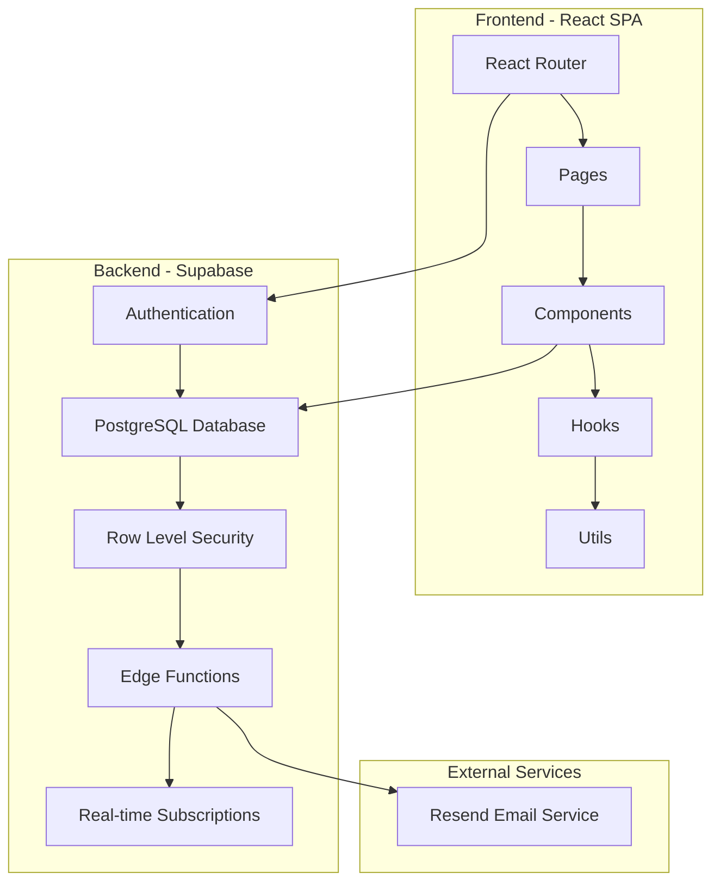
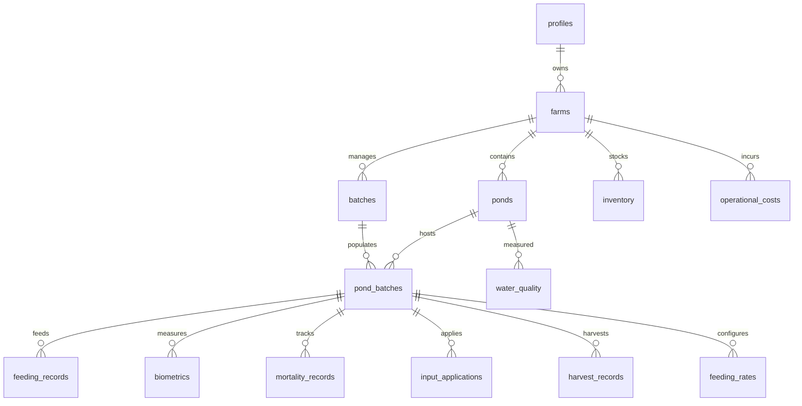
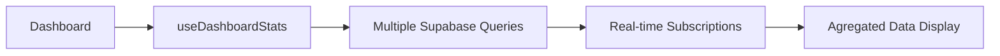
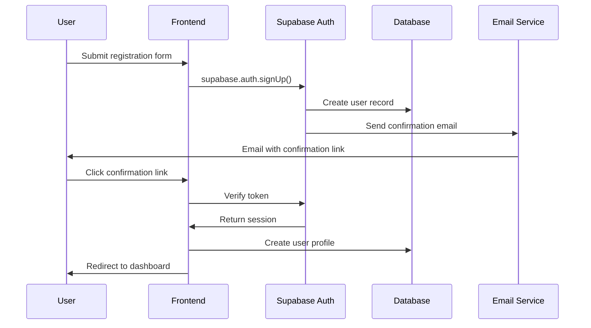
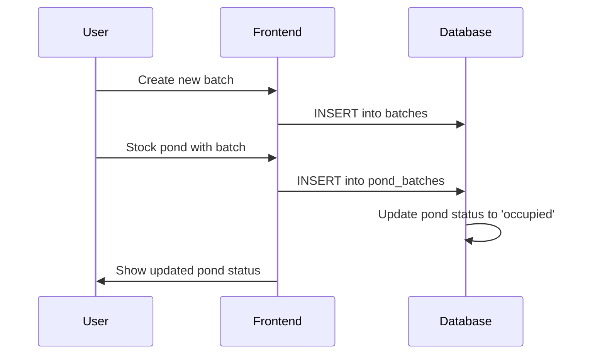
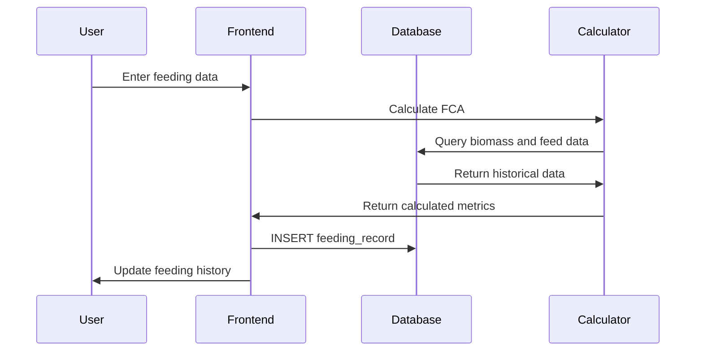
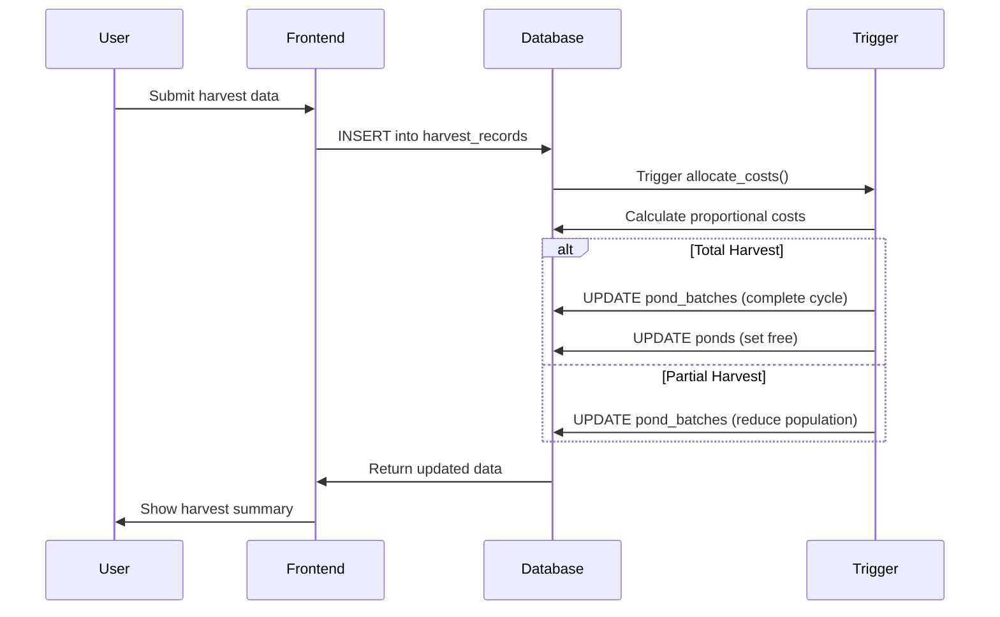
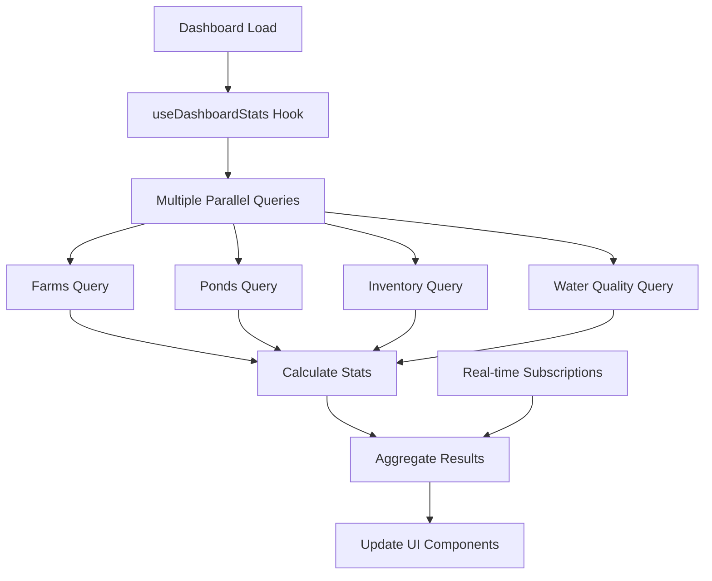

# Documentação Técnica - AquaHub

## Sistema de Gestão Aquícola

### Versão: 1.0
### Data: 2024

---

## Índice

1. [Visão Geral do Sistema](#visão-geral-do-sistema)
2. [Arquitetura](#arquitetura)
3. [Stack Tecnológico](#stack-tecnológico)
4. [Banco de Dados](#banco-de-dados)
5. [Funcionalidades Principais](#funcionalidades-principais)
6. [Componentes e Hooks](#componentes-e-hooks)
7. [Lógica de Negócio](#lógica-de-negócio)
8. [Fluxos de Dados](#fluxos-de-dados)
9. [Segurança](#segurança)
10. [APIs e Integrações](#apis-e-integrações)
11. [Configuração e Deploy](#configuração-e-deploy)

---

## Visão Geral do Sistema

O **AquaHub** é uma plataforma completa de gestão aquícola desenvolvida para otimizar o controle e monitoramento de fazendas de aquicultura. O sistema oferece funcionalidades abrangentes para gestão de fazendas, viveiros, povoamento, alimentação, qualidade da água, biometria, inventário e análise de desempenho.

### Objetivos Principais

- **Gestão Integrada**: Controle centralizado de todas as operações aquícolas
- **Análise de Performance**: Métricas detalhadas de desempenho e rentabilidade
- **Controle de Custos**: Acompanhamento preciso de custos operacionais
- **Qualidade da Água**: Monitoramento contínuo dos parâmetros ambientais
- **Rastreabilidade**: Histórico completo de ciclos produtivos

---

## Arquitetura

### Diagrama da Arquitetura



### Padrões Arquiteturais

- **SPA (Single Page Application)**: Aplicação de página única com React
- **JAMstack**: JavaScript, APIs e Markup pré-construído
- **Database-First**: Esquema do banco como fonte da verdade
- **API-First**: Todas as operações via API REST/GraphQL
- **Mobile-First**: Design responsivo priorizando mobile

---

## Stack Tecnológico

### Frontend
- **React 18.3.1**: Biblioteca principal para UI
- **TypeScript**: Tipagem estática para JavaScript
- **Vite**: Build tool e dev server ultrarrápido
- **React Router Dom 6.30.1**: Roteamento client-side
- **Tailwind CSS**: Framework CSS utility-first
- **Radix UI**: Componentes headless para acessibilidade
- **Lucide React**: Biblioteca de ícones
- **React Hook Form**: Gerenciamento de formulários
- **TanStack Query**: Cache e sincronização de dados
- **Recharts**: Biblioteca para gráficos e visualizações

### Backend
- **Supabase**: Backend-as-a-Service completo
- **PostgreSQL**: Banco de dados relacional
- **PostgREST**: API REST automática
- **GoTrue**: Sistema de autenticação
- **Realtime**: WebSockets para atualizações em tempo real
- **Edge Functions**: Serverless functions em Deno

### Serviços Externos
- **Resend**: Serviço de envio de emails
- **Lovable**: Plataforma de desenvolvimento e deploy

---

## Banco de Dados

### Esquema Geral



### Tabelas Principais

#### 1. **profiles**
```sql
- id: uuid (PK)
- user_id: uuid (FK -> auth.users)
- full_name: text
- phone: text
- created_at: timestamp
- updated_at: timestamp
```
**Finalidade**: Armazena dados adicionais dos usuários além da autenticação básica.

#### 2. **farms**
```sql
- id: uuid (PK)
- user_id: uuid (FK -> profiles.user_id)
- name: text
- location: text
- total_area: numeric
- created_at: timestamp
- updated_at: timestamp
```
**Finalidade**: Representa as fazendas de aquicultura pertencentes aos usuários.

#### 3. **ponds**
```sql
- id: uuid (PK)
- farm_id: uuid (FK -> farms.id)
- name: text
- area: numeric
- depth: numeric
- status: text ('free', 'occupied')
- created_at: timestamp
- updated_at: timestamp
```
**Finalidade**: Viveiros/tanques dentro de cada fazenda.

#### 4. **batches**
```sql
- id: uuid (PK)
- farm_id: uuid (FK -> farms.id)
- name: text
- arrival_date: date
- total_pl_quantity: integer
- pl_cost: numeric
- pl_size: numeric
- survival_rate: numeric (default: 85.0)
- status: text (default: 'active')
- created_at: timestamp
- updated_at: timestamp
```
**Finalidade**: Lotes de pós-larvas (PLs) adquiridos para povoamento.

#### 5. **pond_batches**
```sql
- id: uuid (PK)
- pond_id: uuid (FK -> ponds.id)
- batch_id: uuid (FK -> batches.id)
- pl_quantity: integer
- current_population: integer
- stocking_date: date
- preparation_cost: numeric
- cycle_status: text (default: 'active')
- final_population: integer
- final_biomass: numeric
- final_average_weight: numeric
- final_survival_rate: numeric
- actual_mortality_total: integer
- created_at: timestamp
- updated_at: timestamp
```
**Finalidade**: Relaciona viveiros com lotes, representando ciclos produtivos específicos.

#### 6. **feeding_records**
```sql
- id: uuid (PK)
- pond_batch_id: uuid (FK -> pond_batches.id)
- feeding_date: date
- feeding_time: time
- planned_amount: integer (gramas)
- actual_amount: integer (gramas)
- feed_type_id: uuid
- feed_type_name: text
- unit_cost: numeric
- feeding_rate_percentage: numeric
- notes: text
- created_at: timestamp
- updated_at: timestamp
```
**Finalidade**: Registros de alimentação com quantidades planejadas vs reais.

#### 7. **biometrics**
```sql
- id: uuid (PK)
- pond_batch_id: uuid (FK -> pond_batches.id)
- measurement_date: date
- average_weight: numeric
- sample_size: integer
- uniformity: numeric
- created_at: timestamp
```
**Finalidade**: Medições biométricas para acompanhar crescimento.

#### 8. **water_quality**
```sql
- id: uuid (PK)
- pond_id: uuid (FK -> ponds.id)
- measurement_date: date
- temperature: numeric
- ph_level: numeric
- oxygen_level: numeric
- ammonia: numeric
- turbidity: numeric
- alkalinity: numeric
- hardness: numeric
- notes: text
- created_at: timestamp
- updated_at: timestamp
```
**Finalidade**: Parâmetros de qualidade da água.

#### 9. **mortality_records**
```sql
- id: uuid (PK)
- pond_batch_id: uuid (FK -> pond_batches.id)
- record_date: date
- dead_count: integer
- notes: text
- created_at: timestamp
```
**Finalidade**: Registros de mortalidade diária.

#### 10. **inventory**
```sql
- id: uuid (PK)
- farm_id: uuid (FK -> farms.id)
- name: text
- category: text
- brand: text
- supplier: text
- quantity: integer
- unit_price: numeric
- total_value: numeric
- entry_date: date
- created_at: timestamp
- updated_at: timestamp
```
**Finalidade**: Controle de estoque de insumos e rações.

#### 11. **input_applications**
```sql
- id: uuid (PK)
- pond_batch_id: uuid (FK -> pond_batches.id)
- input_item_id: uuid
- input_item_name: text
- application_date: date
- application_time: time
- quantity_applied: integer
- unit_cost: numeric
- total_cost: numeric
- dosage_per_hectare: numeric
- purpose: text
- notes: text
- created_at: timestamp
- updated_at: timestamp
```
**Finalidade**: Aplicação de insumos (cal, probióticos, etc.).

#### 12. **harvest_records**
```sql
- id: uuid (PK)
- pond_batch_id: uuid (FK -> pond_batches.id)
- harvest_date: date
- harvest_type: text ('partial', 'total')
- population_harvested: integer
- biomass_harvested: numeric
- average_weight_at_harvest: numeric
- price_per_kg: numeric
- total_value: numeric
- expected_population: integer
- expected_biomass: numeric
- actual_mortality_detected: integer
- allocated_feed_cost: numeric
- allocated_input_cost: numeric
- allocated_pl_cost: numeric
- allocated_preparation_cost: numeric
- reconciliation_notes: text
- notes: text
- created_at: timestamp
- updated_at: timestamp
```
**Finalidade**: Registros de despesca com alocação proporcional de custos.

#### 13. **feeding_rates**
```sql
- id: uuid (PK)
- pond_batch_id: uuid (FK -> pond_batches.id)
- farm_id: uuid (FK -> farms.id)
- created_by: uuid
- weight_range_min: numeric
- weight_range_max: numeric
- feeding_percentage: numeric
- meals_per_day: integer
- default_feed_type_id: uuid
- default_feed_type_name: text
- created_at: timestamp
- updated_at: timestamp
```
**Finalidade**: Configuração de taxas de alimentação por faixa de peso.

#### 14. **operational_costs**
```sql
- id: uuid (PK)
- farm_id: uuid (FK -> farms.id)
- pond_batch_id: uuid
- category: text
- description: text
- amount: numeric
- cost_date: date
- created_at: timestamp
- updated_at: timestamp
```
**Finalidade**: Custos operacionais diversos da fazenda.

### Triggers e Funções

#### 1. **handle_new_user()**
```sql
CREATE OR REPLACE FUNCTION public.handle_new_user()
RETURNS trigger AS $$
BEGIN
    INSERT INTO public.profiles (user_id, full_name)
    VALUES (NEW.id, COALESCE(NEW.raw_user_meta_data->>'full_name', ''));
    RETURN NEW;
END;
$$ LANGUAGE plpgsql SECURITY DEFINER;
```
**Finalidade**: Cria automaticamente um perfil quando um usuário se registra.

#### 2. **complete_pond_cycle()**
```sql
CREATE OR REPLACE FUNCTION public.complete_pond_cycle()
RETURNS trigger AS $$
BEGIN
  IF NEW.harvest_type = 'total' THEN
    UPDATE public.pond_batches 
    SET 
      cycle_status = 'completed',
      final_population = NEW.population_harvested,
      final_biomass = NEW.biomass_harvested,
      final_average_weight = NEW.average_weight_at_harvest,
      final_survival_rate = (NEW.population_harvested::numeric / pl_quantity::numeric) * 100,
      actual_mortality_total = pl_quantity - NEW.population_harvested,
      current_population = 0
    WHERE id = NEW.pond_batch_id;
    
    UPDATE public.ponds 
    SET status = 'free'
    WHERE id = (SELECT pond_id FROM public.pond_batches WHERE id = NEW.pond_batch_id);
  END IF;
  
  RETURN NEW;
END;
$$ LANGUAGE plpgsql SECURITY DEFINER;
```
**Finalidade**: Finaliza automaticamente o ciclo produtivo em despescas totais.

#### 3. **allocate_partial_harvest_costs()**
```sql
CREATE OR REPLACE FUNCTION public.allocate_partial_harvest_costs()
RETURNS trigger AS $$
DECLARE
  total_biomass_produced numeric;
  total_feed_cost numeric;
  total_input_cost numeric;
  pl_cost numeric;
  preparation_cost numeric;
  proportion_harvested numeric;
BEGIN
  -- Cálculos complexos de alocação proporcional de custos
  -- Ver código completo na função do banco
END;
$$ LANGUAGE plpgsql SECURITY DEFINER;
```
**Finalidade**: Aloca custos proporcionalmente em despescas parciais.

---

## Funcionalidades Principais

### 1. **Dashboard**

#### Componentes Principais
- `Dashboard.tsx`: Página principal com visão geral
- `StatsCard.tsx`: Cards de estatísticas
- `DashboardSkeleton.tsx`: Loading state

#### Funcionalidades
- **Estatísticas em Tempo Real**: Viveiros ativos, população total, biomassa, valor do inventário
- **Métricas Secundárias**: Peso médio, mortalidade do dia, tarefas pendentes, alertas críticos
- **Ações Rápidas**: Botões para operações frequentes (povoamento, biometria, inventário)
- **Atividades Recentes**: Últimas ações realizadas no sistema
- **Resumo de Performance**: Métricas de desempenho dos ciclos

#### Fluxo de Dados


### 2. **Gestão de Fazendas**

#### Componentes
- `Farm.tsx`: Página de gestão de fazendas
- `StockingContent.tsx`: Informações de povoamento

#### Funcionalidades
- **CRUD de Fazendas**: Criar, visualizar, editar, excluir fazendas
- **Gestão de Viveiros**: Adicionar e configurar viveiros/tanques
- **Histórico de Ciclos**: Visualização de ciclos produtivos anteriores
- **Estatísticas por Fazenda**: Métricas específicas de cada fazenda

### 3. **Povoamento (Stocking)**

#### Componentes
- `Stocking.tsx`: Página de povoamento
- `StockingHistory.tsx`: Histórico de povoamentos

#### Funcionalidades
- **Cadastro de Lotes**: Registro de lotes de pós-larvas
- **Povoamento de Viveiros**: Associação de lotes a viveiros específicos
- **Controle de Custos**: Registro de custos de PLs e preparação
- **Densidade de Povoamento**: Cálculo automático de densidade

#### Lógica de Negócio
```typescript
// Cálculo de densidade
const density = plQuantity / pondArea; // PLs por m²

// Estimativa de sobrevivência
const estimatedSurvival = (plQuantity * survivalRate) / 100;
```

### 4. **Manejos**

#### Componentes
- `Manejos.tsx`: Hub central de manejos
- `BiometryTab.tsx`: Biometria
- `WaterQualityTab.tsx`: Qualidade da água
- `MortalityTab.tsx`: Mortalidade
- `InputApplicationTab.tsx`: Aplicação de insumos

#### Funcionalidades

##### Biometria
- **Pesagem de Amostras**: Registro de peso médio por amostragem
- **Uniformidade**: Cálculo de uniformidade do lote
- **Curva de Crescimento**: Visualização gráfica do crescimento
- **Predição de Despesca**: Estimativa de quando atingir peso ideal

##### Qualidade da Água
- **Parâmetros Físico-Químicos**: pH, oxigênio, temperatura, amônia
- **Alertas Automáticos**: Notificações para valores fora do ideal
- **Histórico Temporal**: Gráficos de evolução dos parâmetros
- **Correlação com Performance**: Análise de impacto na produtividade

##### Mortalidade
- **Registro Diário**: Contagem de mortos por dia
- **Taxa de Mortalidade**: Cálculo percentual acumulado
- **Análise de Causas**: Categorização de possíveis causas
- **Impacto na Sobrevivência**: Ajuste das estimativas de sobrevivência

##### Aplicação de Insumos
- **Registro de Aplicações**: Cal, probióticos, fertilizantes
- **Dosagem por Hectare**: Cálculo automático de dosagens
- **Controle de Custos**: Acompanhamento de gastos com insumos
- **Cronograma de Aplicação**: Planejamento de aplicações futuras

### 5. **Alimentação (Feeding)**

#### Componentes
- `Feeding.tsx`: Página principal de alimentação
- `FeedingSchedule.tsx`: Cronograma de alimentação
- `FeedingRateConfig.tsx`: Configuração de taxas
- `FeedingHistoryPanel.tsx`: Histórico de alimentação
- `FeedingHistoryDialog.tsx`: Detalhes de alimentação

#### Funcionalidades

##### Controle de Ração
- **Quantidade Planejada vs Real**: Comparação entre o planejado e executado
- **Conversão Alimentar (FCA)**: Cálculo automático da eficiência
- **Consumo Total**: Acompanhamento do consumo acumulado
- **Custos de Alimentação**: Controle de gastos com ração

##### Configuração de Taxas
- **Faixas de Peso**: Definição de % de alimentação por faixa de peso
- **Refeições por Dia**: Número de tratos diários
- **Tipo de Ração**: Seleção do tipo de ração para cada faixa
- **Ajustes Automáticos**: Recálculo baseado em peso atual

##### Lógica de Cálculo FCA
```typescript
// Fórmula da Conversão Alimentar
const calculateFCA = (totalFeedKg: number, biomassGainKg: number) => {
  if (biomassGainKg <= 0) return 0;
  return totalFeedKg / biomassGainKg;
};

// Biomassa inicial estimada
const initialBiomass = currentPopulation * initialWeight;

// Biomassa atual
const currentBiomass = currentPopulation * currentWeight;

// Ganho de biomassa
const biomassGain = currentBiomass - initialBiomass;

// FCA atual
const currentFCA = calculateFCA(totalFeedConsumed, biomassGain);
```

### 6. **Inventário**

#### Componentes
- `Inventory.tsx`: Gestão de inventário

#### Funcionalidades
- **Controle de Estoque**: Entrada e saída de materiais
- **Categorização**: Rações, insumos, equipamentos, medicamentos
- **Valores e Fornecedores**: Controle de custos e fornecedores
- **Alertas de Estoque Baixo**: Notificações para reposição
- **Histórico de Movimentação**: Rastreamento de todas as movimentações

### 7. **Relatórios**

#### Componentes
- `Reports.tsx`: Central de relatórios
- `GrowthAnalysis.tsx`: Análise de crescimento
- `OperationalCosts.tsx`: Custos operacionais

#### Funcionalidades

##### Análise de Crescimento
- **Curvas de Crescimento**: Gráficos de evolução do peso
- **Performance por Viveiro**: Comparação entre viveiros
- **Eficiência Alimentar**: Análise de FCA ao longo do tempo
- **Predições**: Estimativas de despesca e produtividade

##### Custos Operacionais
- **Alocação de Custos**: Distribuição proporcional por viveiro/ciclo
- **ROI por Ciclo**: Retorno sobre investimento
- **Comparação de Ciclos**: Análise histórica de performance
- **Margem de Lucro**: Cálculo de rentabilidade

### 8. **Histórico por Viveiro**

#### Componentes
- `PondHistory.tsx`: Histórico detalhado por viveiro
- `HarvestHistoryDetail.tsx`: Detalhes de despesca

#### Funcionalidades
- **Ciclos Anteriores**: Visualização de todos os ciclos do viveiro
- **Performance Histórica**: Métricas de desempenho ao longo do tempo
- **Lições Aprendidas**: Análise de sucessos e problemas
- **Planejamento Futuro**: Insights para próximos ciclos

---

## Componentes e Hooks

### Hooks Customizados

#### 1. **useAuth**
```typescript
export function useAuth() {
  const [user, setUser] = useState<User | null>(null);
  const [session, setSession] = useState<Session | null>(null);
  const [loading, setLoading] = useState(true);

  // Gestão completa de autenticação
  // SignUp, SignIn, SignOut
  // Persistência de sessão
  // Verificação de estado
}
```

#### 2. **useDashboardStats**
```typescript
export const useDashboardStats = (
  farms: any[],
  ponds: any[],
  inventory: any[],
  waterQuality: any[]
) => {
  // Cálculos agregados para dashboard
  // Estatísticas em tempo real
  // Métricas de performance
  // Alertas e notificações
}
```

#### 3. **useSupabaseQuery**
```typescript
export const useSupabaseQuery = <T>(
  queryKey: QueryKey,
  queryFn: () => Promise<T>,
  options?: UseQueryOptions<T>
) => {
  // Wrapper para TanStack Query + Supabase
  // Cache inteligente
  // Error handling
  // Loading states
}
```

#### 4. **use-mobile**
```typescript
export function useIsMobile() {
  // Detecção responsiva
  // Breakpoints customizados
  // Hook para componentes mobile-first
}
```

### Componentes UI Reutilizáveis

#### Baseados em Radix UI
- `Button`, `Card`, `Dialog`, `Select`, `Input`
- `Table`, `Tabs`, `Alert`, `Badge`, `Progress`
- `Calendar`, `Checkbox`, `Form`, `Label`, `Sheet`
- `Toast`, `Tooltip`, `Accordion`, `Avatar`

#### Componentes Específicos do Domínio

##### 1. **StatsCard**
```typescript
interface StatsCardProps {
  title: string;
  value: string | number;
  description?: string;
  icon?: React.ReactNode;
  trend?: {
    value: number;
    isPositive: boolean;
  };
}
```

##### 2. **MobileResponsiveTable**
```typescript
// Tabela que se adapta para mobile
// Cards em telas pequenas
// Tabela completa em desktop
```

##### 3. **Charts e Visualizações**
```typescript
// Baseados em Recharts
// Gráficos de linha para crescimento
// Gráficos de barra para comparações
// Gráficos de área para tendências
```

### Utilitários

#### 1. **quantityUtils.ts**
```typescript
export class QuantityUtils {
  static gramsToKg(grams: number): number {
    return grams / 1000;
  }

  static kgToGrams(kg: number): number {
    return kg * 1000;
  }

  static formatQuantity(value: number, unit: string): string {
    // Formatação inteligente de quantidades
  }

  static calculateDensity(population: number, area: number): number {
    return population / area;
  }
}
```

#### 2. **formatters**
```typescript
// Formatação de moeda
// Formatação de datas
// Formatação de percentuais
// Formatação de números
```

---

## Lógica de Negócio

### 1. **Cálculo de Conversão Alimentar (FCA)**

#### Fórmula Básica
```
FCA = Total de Ração Consumida (kg) / Ganho de Biomassa (kg)
```

#### Implementação
```typescript
const calculateFCA = (
  totalFeedConsumed: number, // em kg
  initialBiomass: number,    // em kg
  currentBiomass: number     // em kg
): number => {
  const biomassGain = currentBiomass - initialBiomass;
  
  if (biomassGain <= 0) return 0;
  
  return totalFeedConsumed / biomassGain;
};
```

#### Fatores que Influenciam o FCA
- **Qualidade da Ração**: Proteína, digestibilidade
- **Frequência de Alimentação**: Número de tratos por dia
- **Qualidade da Água**: Oxigênio, temperatura, pH
- **Densidade de Povoamento**: PLs por m²
- **Tamanho dos Peixes**: Eficiência metabólica por tamanho
- **Temperatura da Água**: Metabolismo dos animais

### 2. **Despesca Parcial vs Total**

#### Despesca Parcial
```typescript
// Atualiza população restante
const remainingPopulation = currentPopulation - harvestedPopulation;

// Mantém o ciclo ativo
const cycleStatus = 'active';

// Aloca custos proporcionalmente
const proportion = harvestedBiomass / totalBiomassProduced;
const allocatedCosts = {
  feed: totalFeedCost * proportion,
  inputs: totalInputCost * proportion,
  pl: plCost * proportion,
  preparation: preparationCost * proportion
};
```

#### Despesca Total
```typescript
// Finaliza o ciclo
const cycleStatus = 'completed';

// Libera o viveiro
const pondStatus = 'free';

// Registra métricas finais
const finalMetrics = {
  finalPopulation: harvestedPopulation,
  finalBiomass: harvestedBiomass,
  finalSurvivalRate: (harvestedPopulation / initialPopulation) * 100,
  totalMortality: initialPopulation - harvestedPopulation
};
```

### 3. **Alocação Proporcional de Custos**

#### Algoritmo de Alocação
```typescript
const allocateHarvestCosts = (
  harvestRecord: HarvestRecord,
  pondBatch: PondBatch
) => {
  // 1. Calcular biomassa total produzida até o momento
  const totalBiomassProduced = calculateTotalBiomassProduced(pondBatch.id);
  
  // 2. Calcular custos totais do ciclo
  const totalCosts = {
    feed: calculateTotalFeedCost(pondBatch.id),
    inputs: calculateTotalInputCost(pondBatch.id),
    pl: calculatePLCost(pondBatch),
    preparation: pondBatch.preparation_cost
  };
  
  // 3. Calcular proporção desta despesca
  const proportion = harvestRecord.biomass_harvested / totalBiomassProduced;
  
  // 4. Alocar custos proporcionalmente
  return {
    allocated_feed_cost: totalCosts.feed * proportion,
    allocated_input_cost: totalCosts.inputs * proportion,
    allocated_pl_cost: totalCosts.pl * proportion,
    allocated_preparation_cost: totalCosts.preparation * proportion
  };
};
```

### 4. **Cálculo de Taxa de Sobrevivência**

#### Fórmula
```
Taxa de Sobrevivência = (População Atual / População Inicial) × 100
```

#### Implementação Dinâmica
```typescript
const calculateSurvivalRate = (
  currentPopulation: number,
  initialPopulation: number,
  mortalityRecords: MortalityRecord[]
): number => {
  // Mortalidade acumulada registrada
  const recordedMortality = mortalityRecords.reduce(
    (sum, record) => sum + record.dead_count, 
    0
  );
  
  // População estimada baseada em mortalidade
  const estimatedPopulation = initialPopulation - recordedMortality;
  
  // Usar a menor entre população estimada e atual
  const effectivePopulation = Math.min(currentPopulation, estimatedPopulation);
  
  return (effectivePopulation / initialPopulation) * 100;
};
```

### 5. **Predição de Crescimento**

#### Modelo de Crescimento
```typescript
interface GrowthModel {
  // Modelo de crescimento de Von Bertalanffy
  L_infinity: number; // Comprimento/peso assintótico
  K: number;          // Coeficiente de crescimento
  t0: number;         // Idade teórica no comprimento zero
}

const predictWeight = (
  age: number, // em dias
  model: GrowthModel
): number => {
  const ageInYears = age / 365;
  const weight = model.L_infinity * (1 - Math.exp(-model.K * (ageInYears - model.t0)));
  return Math.max(0, weight);
};
```

### 6. **Otimização de Alimentação**

#### Cálculo de Quantidade Diária
```typescript
const calculateDailyFeedAmount = (
  currentPopulation: number,
  averageWeight: number, // em gramas
  feedingRate: number,   // percentual do peso corporal
  temperature: number    // temperatura da água
): number => {
  // Biomassa total
  const totalBiomass = (currentPopulation * averageWeight) / 1000; // kg
  
  // Ajuste por temperatura
  const temperatureAdjustment = getTemperatureAdjustment(temperature);
  
  // Quantidade base
  const baseAmount = totalBiomass * (feedingRate / 100);
  
  // Quantidade ajustada
  return baseAmount * temperatureAdjustment;
};

const getTemperatureAdjustment = (temperature: number): number => {
  // Camarão tem metabolismo ótimo entre 26-30°C
  if (temperature < 20) return 0.5;
  if (temperature < 24) return 0.7;
  if (temperature < 26) return 0.85;
  if (temperature <= 30) return 1.0;
  if (temperature <= 32) return 0.9;
  if (temperature <= 35) return 0.7;
  return 0.5; // Acima de 35°C
};
```

---

## Fluxos de Dados

### 1. **Fluxo de Autenticação**



### 2. **Fluxo de Povoamento**



### 3. **Fluxo de Alimentação**



### 4. **Fluxo de Despesca**



### 5. **Fluxo de Dashboard**



---

## Segurança

### 1. **Row Level Security (RLS)**

#### Políticas de Acesso
Todas as tabelas implementam RLS para garantir que usuários só acessem seus próprios dados:

```sql
-- Exemplo para tabela farms
CREATE POLICY "Users can view own farms" ON public.farms
FOR SELECT USING (auth.uid() = user_id);

CREATE POLICY "Users can insert own farms" ON public.farms
FOR INSERT WITH CHECK (auth.uid() = user_id);

CREATE POLICY "Users can update own farms" ON public.farms
FOR UPDATE USING (auth.uid() = user_id);

CREATE POLICY "Users can delete own farms" ON public.farms
FOR DELETE USING (auth.uid() = user_id);
```

#### Políticas Cascata
Para tabelas relacionadas, as políticas verificam ownership através de JOINs:

```sql
-- Exemplo para pond_batches
CREATE POLICY "Users can view pond_batches from own farms" ON public.pond_batches
FOR SELECT USING (
  EXISTS (
    SELECT 1 FROM ponds p 
    JOIN farms f ON p.farm_id = f.id 
    WHERE p.id = pond_batches.pond_id 
    AND f.user_id = auth.uid()
  )
);
```

### 2. **Sanitização de Dados**

#### Função de Sanitização
```sql
CREATE OR REPLACE FUNCTION public.sanitize_phone(phone_input text)
RETURNS text AS $$
BEGIN
  IF phone_input IS NULL THEN
    RETURN NULL;
  END IF;
  
  -- Remove tudo exceto dígitos e + no início
  RETURN regexp_replace(phone_input, '[^\d+]', '', 'g');
END;
$$ LANGUAGE plpgsql;
```

#### Trigger de Sanitização
```sql
CREATE OR REPLACE FUNCTION public.sanitize_profile_data()
RETURNS trigger AS $$
BEGIN
  -- Sanitiza telefone
  IF NEW.phone IS NOT NULL THEN
    NEW.phone = public.sanitize_phone(NEW.phone);
  END IF;
  
  -- Impede alteração de user_id
  IF TG_OP = 'UPDATE' AND OLD.user_id != NEW.user_id THEN
    RAISE EXCEPTION 'Cannot change user_id';
  END IF;
  
  RETURN NEW;
END;
$$ LANGUAGE plpgsql SECURITY DEFINER;
```

### 3. **Validação no Frontend**

#### Usando React Hook Form + Zod
```typescript
import { z } from 'zod';
import { useForm } from 'react-hook-form';
import { zodResolver } from '@hookform/resolvers/zod';

const farmSchema = z.object({
  name: z.string().min(1, 'Nome é obrigatório').max(100),
  location: z.string().optional(),
  total_area: z.number().positive('Área deve ser positiva').optional()
});

type FarmFormData = z.infer<typeof farmSchema>;

export const FarmForm = () => {
  const form = useForm<FarmFormData>({
    resolver: zodResolver(farmSchema),
    defaultValues: {
      name: '',
      location: '',
      total_area: undefined
    }
  });

  // ... resto do componente
};
```

### 4. **Controle de Acesso**

#### Middleware de Autenticação
```typescript
const useAuthGuard = () => {
  const { user, loading } = useAuth();
  const navigate = useNavigate();

  useEffect(() => {
    if (!loading && !user) {
      navigate('/auth');
    }
  }, [user, loading, navigate]);

  return { user, loading };
};
```

#### Proteção de Rotas
```typescript
const ProtectedRoute = ({ children }: { children: React.ReactNode }) => {
  const { user, loading } = useAuthGuard();

  if (loading) {
    return <DashboardSkeleton />;
  }

  if (!user) {
    return null; // Será redirecionado pelo useAuthGuard
  }

  return <>{children}</>;
};
```

### 5. **Edge Functions Security**

#### CORS Headers
```typescript
const corsHeaders = {
  'Access-Control-Allow-Origin': '*',
  'Access-Control-Allow-Headers': 'authorization, x-client-info, apikey, content-type',
};
```

#### JWT Verification
```typescript
// Por padrão, edge functions verificam JWT automaticamente
// Para funções públicas, desabilitar em config.toml:
[functions.public-function]
verify_jwt = false
```

---

## APIs e Integrações

### 1. **Supabase APIs**

#### PostgREST API
Gerada automaticamente a partir do schema do banco:

```typescript
// Exemplo de queries
const { data: farms } = await supabase
  .from('farms')
  .select('*')
  .eq('user_id', userId);

const { data: pondBatches } = await supabase
  .from('pond_batches')
  .select(`
    *,
    pond:ponds(*),
    batch:batches(*)
  `)
  .eq('cycle_status', 'active');
```

#### Realtime API
```typescript
// Subscrição para mudanças em tempo real
useEffect(() => {
  const subscription = supabase
    .channel('dashboard-updates')
    .on('postgres_changes', 
      { 
        event: '*', 
        schema: 'public', 
        table: 'feeding_records' 
      },
      (payload) => {
        console.log('Feed record changed:', payload);
        // Atualizar estado local
      }
    )
    .subscribe();

  return () => subscription.unsubscribe();
}, []);
```

### 2. **Email Service Integration**

#### Resend API
```typescript
// Edge function para emails customizados
const resend = new Resend(Deno.env.get("RESEND_API_KEY"));

const emailResponse = await resend.emails.send({
  from: "AquaHub <noreply@aquahub.com>",
  to: [user.email],
  subject: emailSubject,
  html: emailHtml,
});
```

### 3. **Webhook Configuration**

#### Supabase Auth Webhooks
```sql
-- Configurar webhook para interceptar emails de auth
INSERT INTO auth.hooks (hook_name, hook_url, events)
VALUES (
  'send-custom-email',
  'https://your-project.supabase.co/functions/v1/send-custom-email',
  ARRAY['signup.confirm', 'user.recovery']
);
```

---

## Configuração e Deploy

### 1. **Estrutura do Projeto**

```
aquahub/
├── src/
│   ├── components/
│   │   ├── ui/          # Componentes base (shadcn)
│   │   └── *.tsx        # Componentes específicos
│   ├── hooks/           # Hooks customizados
│   ├── lib/             # Utilitários e helpers
│   ├── pages/           # Páginas/rotas da aplicação
│   └── integrations/
│       └── supabase/    # Cliente e tipos Supabase
├── supabase/
│   ├── functions/       # Edge functions
│   ├── migrations/      # Migrações do banco
│   └── config.toml      # Configuração Supabase
├── public/              # Assets estáticos
└── docs/               # Documentação
```

### 2. **Variáveis de Ambiente**

#### Supabase Configuration
```typescript
// src/integrations/supabase/client.ts
const SUPABASE_URL = "https://cwrzrgojacgtavuckcuv.supabase.co";
const SUPABASE_PUBLISHABLE_KEY = "eyJhbGciOiJIUzI1NiIs...";
```

#### Edge Functions Environment
```typescript
// Disponíveis automaticamente nas edge functions
Deno.env.get('SUPABASE_URL')
Deno.env.get('SUPABASE_ANON_KEY') 
Deno.env.get('SUPABASE_SERVICE_ROLE_KEY')
```

### 3. **Deploy Process**

#### Lovable Platform
- Deploy automático a cada commit
- Preview environments para branches
- Zero-config deployment
- CDN global automático

#### Custom Domain Setup
1. Configurar domínio no Lovable
2. Atualizar DNS records
3. Configurar SSL automático
4. Atualizar redirect URLs no Supabase

### 4. **Monitoring & Analytics**

#### Supabase Analytics
- Logs de autenticação
- Logs de database
- Logs de edge functions
- Métricas de performance

#### Custom Analytics
```typescript
// Tracking de eventos importantes
const trackEvent = (event: string, properties: any) => {
  // Implementar analytics customizado
  console.log('Event:', event, properties);
};

// Exemplo de uso
trackEvent('pond_stocked', {
  pondId,
  batchId,
  plQuantity,
  density
});
```

---

## Considerações de Performance

### 1. **Database Optimization**

#### Indexes Recomendados
```sql
-- Índices para queries frequentes
CREATE INDEX idx_pond_batches_active ON pond_batches(cycle_status) WHERE cycle_status = 'active';
CREATE INDEX idx_feeding_records_date ON feeding_records(feeding_date DESC);
CREATE INDEX idx_biometrics_pond_batch ON biometrics(pond_batch_id, measurement_date DESC);
CREATE INDEX idx_water_quality_pond_date ON water_quality(pond_id, measurement_date DESC);
```

#### Query Optimization
```typescript
// Usar select específico ao invés de *
const { data } = await supabase
  .from('pond_batches')
  .select('id, current_population, stocking_date')
  .eq('cycle_status', 'active');

// Pagination para grandes datasets
const { data } = await supabase
  .from('feeding_records')
  .select('*')
  .range(0, 49) // Primeiros 50 registros
  .order('feeding_date', { ascending: false });
```

### 2. **Frontend Optimization**

#### Code Splitting
```typescript
// Lazy loading de páginas
const Dashboard = lazy(() => import('./pages/Dashboard'));
const Reports = lazy(() => import('./pages/Reports'));

// Suspense wrapper
<Suspense fallback={<DashboardSkeleton />}>
  <Dashboard />
</Suspense>
```

#### Memoization
```typescript
// Memoizar cálculos pesados
const dashboardStats = useMemo(() => {
  return calculateDashboardStats(farms, ponds, inventory);
}, [farms, ponds, inventory]);

// Memoizar componentes caros
const ExpensiveChart = memo(({ data }: { data: ChartData[] }) => {
  return <Chart data={data} />;
});
```

#### Virtual Scrolling
```typescript
// Para listas grandes de dados
import { FixedSizeList as List } from 'react-window';

const VirtualizedTable = ({ items }: { items: any[] }) => (
  <List
    height={600}
    itemCount={items.length}
    itemSize={50}
    itemData={items}
  >
    {Row}
  </List>
);
```

---

## Roadmap e Melhorias Futuras

### 1. **Funcionalidades Planejadas**

#### Mobile App
- App nativo usando Capacitor
- Funcionalidades offline
- Sincronização automática
- Push notifications

#### Análise Avançada
- Machine Learning para predições
- Análise de padrões históricos
- Otimização automática de parâmetros
- Alertas inteligentes

#### Integração IoT
- Sensores de qualidade da água
- Alimentadores automáticos
- Monitoramento remoto
- Coleta de dados automática

### 2. **Melhorias Técnicas**

#### Performance
- Service Workers para cache
- Otimização de imagens
- Compressão de dados
- CDN para assets

#### Segurança
- Audit logs detalhados
- Backup automático
- Disaster recovery
- Compliance LGPD

#### Experiência do Usuário
- Tutorial interativo
- Assistente virtual
- Temas customizáveis
- Acessibilidade melhorada

---

## Conclusão

O **AquaHub** representa uma solução completa e moderna para gestão aquícola, combinando tecnologias de ponta com conhecimento específico do setor. A arquitetura modular e escalável permite evolução contínua, enquanto a interface intuitiva garante adoção fácil pelos usuários.

### Principais Diferenciais

1. **Completude**: Cobre todos os aspectos da gestão aquícola
2. **Precisão**: Cálculos precisos de métricas de performance
3. **Flexibilidade**: Adaptável a diferentes tipos de aquicultura
4. **Escalabilidade**: Suporta desde pequenos produtores até grandes empresas
5. **Modernidade**: Tecnologias atuais e melhores práticas de desenvolvimento

### Impacto Esperado

- **Aumento de Produtividade**: Otimização de processos e redução de desperdícios
- **Melhoria na Rentabilidade**: Controle preciso de custos e receitas
- **Qualidade Superior**: Monitoramento contínuo de parâmetros críticos
- **Sustentabilidade**: Uso eficiente de recursos e redução de impacto ambiental
- **Competitividade**: Dados para tomada de decisões estratégicas

O sistema está preparado para apoiar o crescimento sustentável do setor aquícola brasileiro, oferecendo as ferramentas necessárias para uma gestão profissional e eficiente.

---

*Documentação técnica gerada em: Agosto 2024*  
*Versão do sistema: 1.0*  
*Última atualização: 20/08/2024*