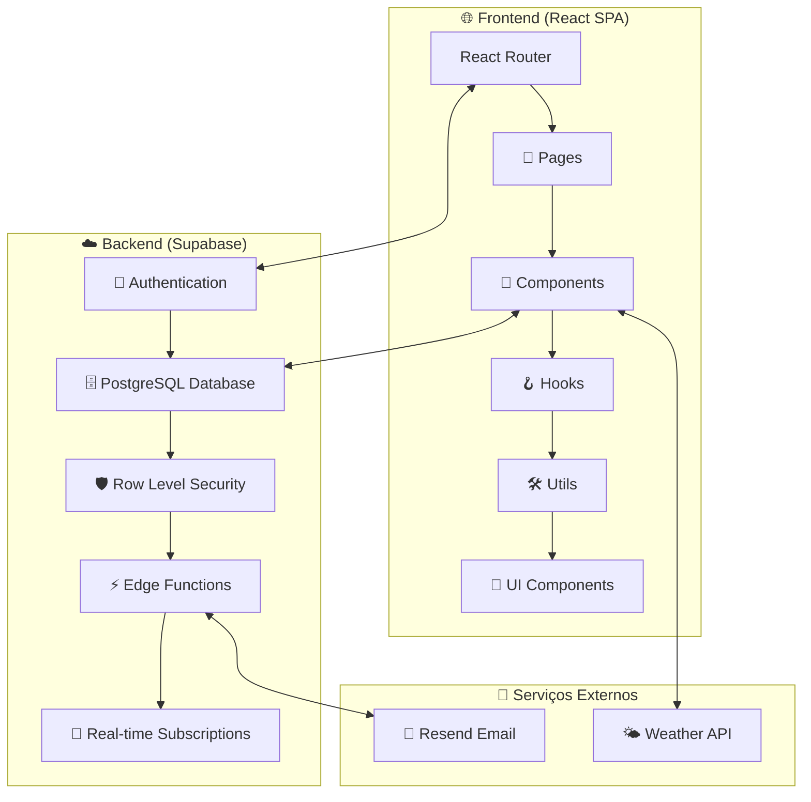
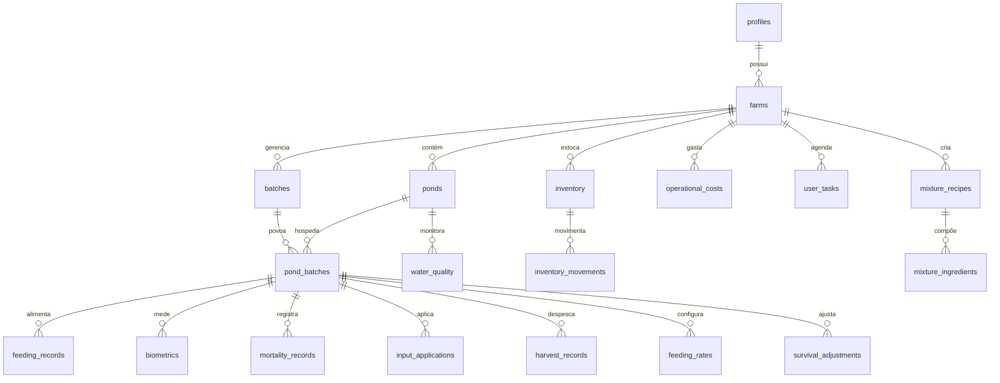
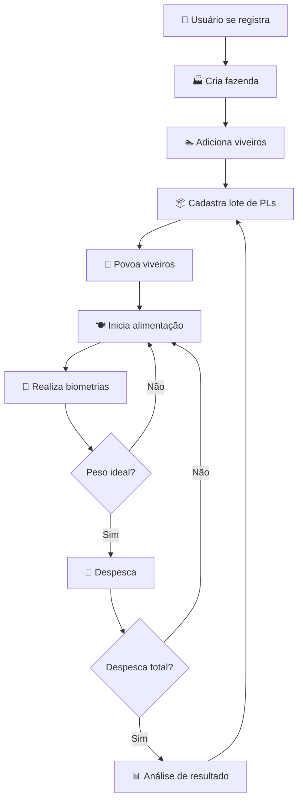
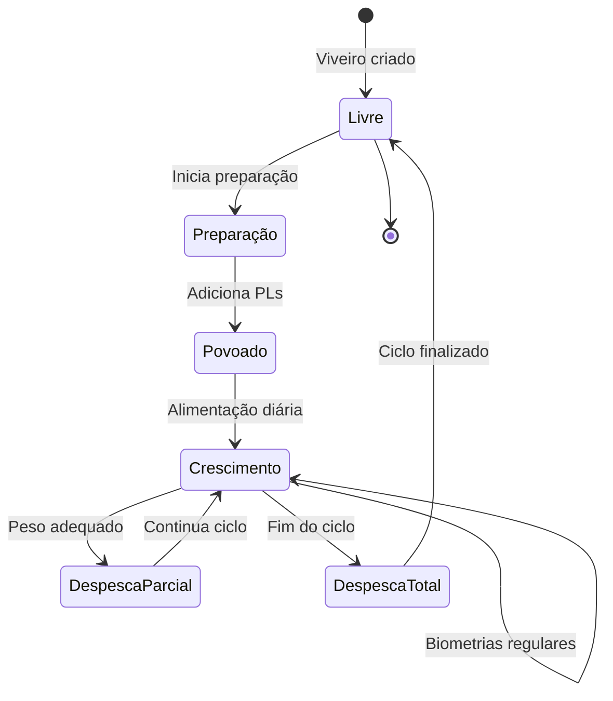
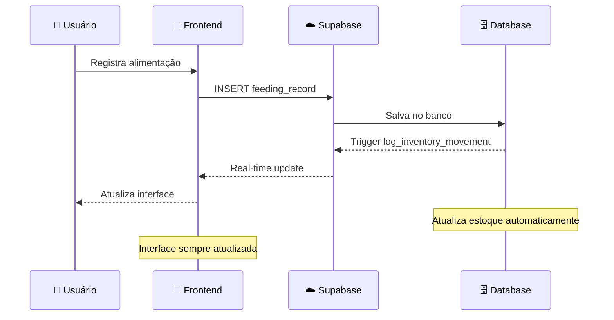

# 🐟 AquaHub - Sistema Completo de Gestão Aquícola

## 📋 Índice Geral

1. [🎯 O que é o AquaHub](#-o-que-é-o-aquahub)
2. [🏗️ Arquitetura do Sistema](#️-arquitetura-do-sistema)
3. [💻 Stack Tecnológico](#-stack-tecnológico)
4. [🗄️ Banco de Dados Completo](#️-banco-de-dados-completo)
5. [🔄 Fluxos de Trabalho](#-fluxos-de-trabalho)
6. [📱 Funcionalidades Detalhadas](#-funcionalidades-detalhadas)
7. [🧩 Componentes e Estrutura](#-componentes-e-estrutura)
8. [🔒 Segurança e Autenticação](#-segurança-e-autenticação)
9. [📊 Lógica de Negócio](#-lógica-de-negócio)
10. [🛠️ Como Usar o Sistema](#️-como-usar-o-sistema)
11. [⚙️ Configuração e Deploy](#️-configuração-e-deploy)
12. [🔧 Desenvolvimento](#-desenvolvimento)

---

## 🎯 O que é o AquaHub

O **AquaHub** é uma plataforma completa de gestão aquícola que permite controlar todos os aspectos de uma fazenda de camarão/peixe, desde o povoamento até a despesca, incluindo:

### 🏆 Objetivos Principais
- **Controle Total**: Gerencie fazendas, viveiros, lotes e ciclos produtivos
- **Rastreabilidade**: Histórico completo de cada animal do nascimento à despesca
- **Controle de Custos**: Acompanhe custos de ração, insumos, mão de obra
- **Análise de Performance**: Métricas detalhadas de sobrevivência, crescimento e rentabilidade
- **Qualidade da Água**: Monitoramento contínuo de parâmetros ambientais
- **Inventário Inteligente**: Controle de estoque com alertas e previsões

### 🎯 Para Quem é Feito
- **Aquicultores**: Pequenos e médios produtores
- **Fazendas Comerciais**: Operações de grande escala
- **Técnicos em Aquicultura**: Profissionais que assessoram produtores
- **Investidores**: Acompanhamento de ROI e performance

---

## 🏗️ Arquitetura do Sistema

### 📐 Visão Geral da Arquitetura



### 🏛️ Padrões Arquiteturais Utilizados

1. **SPA (Single Page Application)**: Aplicação de página única para performance
2. **JAMstack**: JavaScript + APIs + Markup para escalabilidade
3. **Database-First**: Esquema do banco como fonte da verdade
4. **Mobile-First**: Design responsivo priorizando dispositivos móveis
5. **Real-time First**: Atualizações instantâneas via WebSockets

---

## 💻 Stack Tecnológico

### 🎨 Frontend
| Tecnologia | Versão | Função |
|------------|--------|---------|
| **React** | 18.3.1 | Framework principal |
| **TypeScript** | Mais recente | Tipagem estática |
| **Vite** | Mais recente | Build tool ultrarrápido |
| **React Router** | 6.30.1 | Roteamento SPA |
| **Tailwind CSS** | Mais recente | Styling utility-first |
| **Radix UI** | Mais recente | Componentes acessíveis |
| **React Hook Form** | 7.61.1 | Gerenciamento de formulários |
| **TanStack Query** | 5.83.0 | Cache e sincronização |
| **Recharts** | 2.15.4 | Gráficos e visualizações |
| **Lucide React** | 0.462.0 | Biblioteca de ícones |

### ⚡ Backend
| Serviço | Função |
|---------|---------|
| **Supabase** | Backend-as-a-Service completo |
| **PostgreSQL** | Banco de dados relacional |
| **PostgREST** | API REST automática |
| **GoTrue** | Sistema de autenticação |
| **Realtime** | WebSockets para atualizações |
| **Edge Functions** | Serverless functions |

### 🌐 Serviços Externos
- **Resend**: Envio de emails transacionais
- **Lovable**: Plataforma de desenvolvimento e deploy

---

## 🗄️ Banco de Dados Completo

### 🔗 Diagrama de Relacionamentos



### 📋 Tabelas Detalhadas

#### 👤 **profiles** - Perfis de Usuários
```sql
CREATE TABLE profiles (
  id uuid PRIMARY KEY DEFAULT gen_random_uuid(),
  user_id uuid REFERENCES auth.users NOT NULL UNIQUE,
  full_name text NOT NULL,
  phone text,
  created_at timestamptz DEFAULT now(),
  updated_at timestamptz DEFAULT now()
);
```
**📝 Finalidade**: Armazena informações adicionais dos usuários além da autenticação básica do Supabase.

#### 🏭 **farms** - Fazendas
```sql
CREATE TABLE farms (
  id uuid PRIMARY KEY DEFAULT gen_random_uuid(),
  user_id uuid NOT NULL, -- FK para profiles.user_id
  name text NOT NULL,
  location text,
  total_area numeric, -- em hectares
  created_at timestamptz DEFAULT now(),
  updated_at timestamptz DEFAULT now()
);
```
**📝 Finalidade**: Representa as fazendas de aquicultura. Um usuário pode ter múltiplas fazendas.

#### 🏊 **ponds** - Viveiros/Tanques
```sql
CREATE TABLE ponds (
  id uuid PRIMARY KEY DEFAULT gen_random_uuid(),
  farm_id uuid REFERENCES farms(id) NOT NULL,
  name text NOT NULL,
  area numeric NOT NULL, -- em metros quadrados
  depth numeric NOT NULL, -- em metros
  status text DEFAULT 'free' CHECK (status IN ('free', 'occupied')),
  created_at timestamptz DEFAULT now(),
  updated_at timestamptz DEFAULT now()
);
```
**📝 Finalidade**: Viveiros/tanques dentro de cada fazenda. Status indica se está livre ou ocupado.

#### 📦 **batches** - Lotes de Pós-Larvas
```sql
CREATE TABLE batches (
  id uuid PRIMARY KEY DEFAULT gen_random_uuid(),
  farm_id uuid REFERENCES farms(id) NOT NULL,
  name text NOT NULL,
  arrival_date date NOT NULL,
  total_pl_quantity integer NOT NULL, -- quantidade total de PLs
  pl_cost numeric NOT NULL, -- custo por milheiro
  pl_size numeric NOT NULL, -- tamanho em mm
  survival_rate numeric DEFAULT 85.0, -- taxa esperada de sobrevivência
  status text DEFAULT 'active',
  created_at timestamptz DEFAULT now(),
  updated_at timestamptz DEFAULT now()
);
```
**📝 Finalidade**: Lotes de pós-larvas adquiridos. Um lote pode ser dividido entre vários viveiros.

#### 🔄 **pond_batches** - Ciclos Produtivos
```sql
CREATE TABLE pond_batches (
  id uuid PRIMARY KEY DEFAULT gen_random_uuid(),
  pond_id uuid REFERENCES ponds(id) NOT NULL,
  batch_id uuid REFERENCES batches(id) NOT NULL,
  pl_quantity integer NOT NULL, -- PLs colocadas neste viveiro
  current_population integer NOT NULL, -- população atual estimada
  stocking_date date NOT NULL,
  preparation_cost numeric DEFAULT 0, -- custo de preparação do viveiro
  cycle_status text DEFAULT 'active' CHECK (cycle_status IN ('active', 'completed')),
  -- Dados finais (preenchidos na despesca total)
  final_population integer,
  final_biomass numeric,
  final_average_weight numeric,
  final_survival_rate numeric,
  actual_mortality_total integer DEFAULT 0,
  created_at timestamptz DEFAULT now(),
  updated_at timestamptz DEFAULT now()
);
```
**📝 Finalidade**: Representa um ciclo produtivo específico (um lote em um viveiro). É o coração do sistema.

#### 🍽️ **feeding_records** - Registros de Alimentação
```sql
CREATE TABLE feeding_records (
  id uuid PRIMARY KEY DEFAULT gen_random_uuid(),
  pond_batch_id uuid REFERENCES pond_batches(id) NOT NULL,
  feeding_date date NOT NULL,
  feeding_time time NOT NULL,
  planned_amount integer NOT NULL, -- quantidade planejada em gramas
  actual_amount integer NOT NULL, -- quantidade real fornecida em gramas
  feed_type_id uuid, -- FK para inventory
  feed_type_name text,
  unit_cost numeric DEFAULT 0, -- custo por kg
  feeding_rate_percentage numeric DEFAULT 0, -- % da biomassa
  notes text,
  created_at timestamptz DEFAULT now(),
  updated_at timestamptz DEFAULT now()
);
```
**📝 Finalidade**: Registra cada refeição fornecida, com planejado vs real para controle preciso.

#### 📏 **biometrics** - Biometrias
```sql
CREATE TABLE biometrics (
  id uuid PRIMARY KEY DEFAULT gen_random_uuid(),
  pond_batch_id uuid REFERENCES pond_batches(id) NOT NULL,
  measurement_date date NOT NULL,
  average_weight numeric NOT NULL, -- peso médio em gramas
  sample_size integer, -- número de animais pesados
  uniformity numeric, -- percentual de uniformidade
  created_at timestamptz DEFAULT now()
);
```
**📝 Finalidade**: Acompanha o crescimento através de pesagens periódicas.

#### 💧 **water_quality** - Qualidade da Água
```sql
CREATE TABLE water_quality (
  id uuid PRIMARY KEY DEFAULT gen_random_uuid(),
  pond_id uuid REFERENCES ponds(id) NOT NULL,
  measurement_date date NOT NULL,
  temperature numeric, -- °C
  ph_level numeric, -- 0-14
  oxygen_level numeric, -- mg/L
  ammonia numeric, -- mg/L
  nitrite numeric, -- mg/L
  turbidity numeric, -- NTU
  alkalinity numeric, -- mg/L
  hardness numeric, -- mg/L
  notes text,
  created_at timestamptz DEFAULT now(),
  updated_at timestamptz DEFAULT now()
);
```
**📝 Finalidade**: Monitora parâmetros físico-químicos da água.

#### ☠️ **mortality_records** - Mortalidade
```sql
CREATE TABLE mortality_records (
  id uuid PRIMARY KEY DEFAULT gen_random_uuid(),
  pond_batch_id uuid REFERENCES pond_batches(id) NOT NULL,
  record_date date NOT NULL,
  dead_count integer NOT NULL,
  notes text,
  created_at timestamptz DEFAULT now()
);
```
**📝 Finalidade**: Registra mortalidade diária para cálculos de sobrevivência.

#### 📦 **inventory** - Inventário
```sql
CREATE TABLE inventory (
  id uuid PRIMARY KEY DEFAULT gen_random_uuid(),
  farm_id uuid REFERENCES farms(id) NOT NULL,
  name text NOT NULL,
  category text NOT NULL, -- 'Ração', 'Insumo', 'Mistura'
  brand text,
  supplier text,
  quantity integer NOT NULL DEFAULT 0, -- estoque atual em kg
  unit_price numeric NOT NULL DEFAULT 0, -- preço por kg
  total_value numeric NOT NULL DEFAULT 0, -- valor total do estoque
  minimum_stock_threshold integer, -- alerta de estoque baixo
  purchase_quantity numeric, -- quantidade da última compra
  purchase_unit_price numeric, -- preço da última compra
  purchase_unit text DEFAULT 'kg',
  entry_date date NOT NULL,
  created_at timestamptz DEFAULT now(),
  updated_at timestamptz DEFAULT now()
);
```
**📝 Finalidade**: Controla estoque de rações, insumos e misturas.

#### 📊 **inventory_movements** - Movimentações de Estoque
```sql
CREATE TABLE inventory_movements (
  id uuid PRIMARY KEY DEFAULT gen_random_uuid(),
  inventory_item_id uuid REFERENCES inventory(id) NOT NULL,
  farm_id uuid REFERENCES farms(id) NOT NULL,
  movement_type text NOT NULL CHECK (movement_type IN ('entrada', 'saida')),
  quantity_change integer NOT NULL,
  previous_quantity integer NOT NULL,
  new_quantity integer NOT NULL,
  reason text,
  reference_type text, -- 'feeding', 'input_application', 'purchase', etc.
  reference_id uuid, -- ID da operação que causou a movimentação
  notes text,
  created_by uuid NOT NULL,
  created_at timestamptz DEFAULT now()
);
```
**📝 Finalidade**: Histórico completo de movimentações de estoque com rastreabilidade.

#### 💊 **input_applications** - Aplicação de Insumos
```sql
CREATE TABLE input_applications (
  id uuid PRIMARY KEY DEFAULT gen_random_uuid(),
  pond_batch_id uuid REFERENCES pond_batches(id) NOT NULL,
  input_item_id uuid NOT NULL, -- FK para inventory
  input_item_name text NOT NULL,
  application_date date NOT NULL,
  application_time time,
  quantity_applied integer NOT NULL, -- em gramas
  unit_cost numeric,
  total_cost numeric,
  dosage_per_hectare numeric, -- dosagem por hectare
  purpose text, -- finalidade da aplicação
  notes text,
  created_at timestamptz DEFAULT now(),
  updated_at timestamptz DEFAULT now()
);
```
**📝 Finalidade**: Registra aplicação de cal, probióticos, antibióticos, etc.

#### 🎣 **harvest_records** - Despescas
```sql
CREATE TABLE harvest_records (
  id uuid PRIMARY KEY DEFAULT gen_random_uuid(),
  pond_batch_id uuid REFERENCES pond_batches(id) NOT NULL,
  harvest_date date NOT NULL,
  harvest_type text NOT NULL CHECK (harvest_type IN ('partial', 'total')),
  population_harvested integer NOT NULL DEFAULT 0,
  biomass_harvested numeric NOT NULL DEFAULT 0, -- kg
  average_weight_at_harvest numeric,
  price_per_kg numeric,
  total_value numeric,
  expected_population integer,
  expected_biomass numeric,
  actual_mortality_detected integer DEFAULT 0,
  -- Alocação proporcional de custos
  allocated_feed_cost numeric DEFAULT 0,
  allocated_input_cost numeric DEFAULT 0,
  allocated_pl_cost numeric DEFAULT 0,
  allocated_preparation_cost numeric DEFAULT 0,
  reconciliation_notes text,
  notes text,
  created_at timestamptz DEFAULT now(),
  updated_at timestamptz DEFAULT now()
);
```
**📝 Finalidade**: Registra despescas com alocação proporcional de custos.

#### ⚙️ **feeding_rates** - Taxas de Alimentação
```sql
CREATE TABLE feeding_rates (
  id uuid PRIMARY KEY DEFAULT gen_random_uuid(),
  pond_batch_id uuid REFERENCES pond_batches(id), -- NULL para templates da fazenda
  farm_id uuid REFERENCES farms(id), -- Para templates da fazenda
  created_by uuid NOT NULL,
  weight_range_min numeric NOT NULL,
  weight_range_max numeric NOT NULL,
  feeding_percentage numeric NOT NULL, -- % da biomassa
  meals_per_day integer NOT NULL,
  default_feed_type_id uuid, -- FK para inventory
  default_feed_type_name text,
  created_at timestamptz DEFAULT now(),
  updated_at timestamptz DEFAULT now()
);
```
**📝 Finalidade**: Define taxas de alimentação por faixa de peso (templates e específicas).

#### 🧪 **mixture_recipes** - Receitas de Misturas
```sql
CREATE TABLE mixture_recipes (
  id uuid PRIMARY KEY DEFAULT gen_random_uuid(),
  farm_id uuid REFERENCES farms(id) NOT NULL,
  name text NOT NULL,
  description text,
  category text NOT NULL DEFAULT 'Mistura',
  total_yield_grams integer NOT NULL DEFAULT 0, -- rendimento total em gramas
  unit_cost numeric NOT NULL DEFAULT 0, -- custo por kg da mistura
  created_at timestamptz DEFAULT now(),
  updated_at timestamptz DEFAULT now()
);
```
**📝 Finalidade**: Receitas para criação de misturas customizadas.

#### 🥄 **mixture_ingredients** - Ingredientes das Misturas
```sql
CREATE TABLE mixture_ingredients (
  id uuid PRIMARY KEY DEFAULT gen_random_uuid(),
  recipe_id uuid REFERENCES mixture_recipes(id) NOT NULL,
  inventory_item_id uuid NOT NULL, -- FK para inventory
  inventory_item_name text NOT NULL,
  quantity_ratio numeric NOT NULL, -- proporção no total (0-1)
  created_at timestamptz DEFAULT now()
);
```
**📝 Finalidade**: Ingredientes e proporções de cada mistura.

#### 📈 **survival_adjustments** - Ajustes de Sobrevivência
```sql
CREATE TABLE survival_adjustments (
  id uuid PRIMARY KEY DEFAULT gen_random_uuid(),
  pond_batch_id uuid REFERENCES pond_batches(id) NOT NULL,
  adjustment_date date NOT NULL,
  adjustment_type text NOT NULL, -- 'biometry', 'mortality', 'manual'
  previous_population integer NOT NULL,
  adjusted_population integer NOT NULL,
  reason text,
  estimated_survival_rate numeric,
  calculated_survival_rate numeric,
  estimated_biomass_kg numeric,
  biometry_based_biomass_kg numeric,
  latest_average_weight_g numeric,
  notes text,
  created_at timestamptz DEFAULT now(),
  updated_at timestamptz DEFAULT now()
);
```
**📝 Finalidade**: Histórico de ajustes na população estimada.

#### 💰 **operational_costs** - Custos Operacionais
```sql
CREATE TABLE operational_costs (
  id uuid PRIMARY KEY DEFAULT gen_random_uuid(),
  farm_id uuid REFERENCES farms(id) NOT NULL,
  pond_batch_id uuid REFERENCES pond_batches(id), -- NULL para custos gerais
  category text NOT NULL, -- 'Mão de obra', 'Combustível', 'Energia', etc.
  description text,
  amount numeric NOT NULL DEFAULT 0,
  cost_date date NOT NULL,
  created_at timestamptz DEFAULT now(),
  updated_at timestamptz DEFAULT now()
);
```
**📝 Finalidade**: Custos operacionais da fazenda (mão de obra, energia, etc.).

#### ✅ **user_tasks** - Tarefas do Usuário
```sql
CREATE TABLE user_tasks (
  id uuid PRIMARY KEY DEFAULT gen_random_uuid(),
  user_id uuid NOT NULL,
  farm_id uuid REFERENCES farms(id) NOT NULL,
  title text NOT NULL,
  description text,
  due_date date,
  completed boolean NOT NULL DEFAULT false,
  created_at timestamptz DEFAULT now(),
  updated_at timestamptz DEFAULT now()
);
```
**📝 Finalidade**: Sistema de tarefas e lembretes para o usuário.

### 🤖 Triggers e Funções Automáticas

#### 1. **handle_new_user()** - Criação Automática de Perfil
```sql
CREATE OR REPLACE FUNCTION public.handle_new_user()
RETURNS trigger AS $$
BEGIN
  INSERT INTO public.profiles (user_id, full_name)
  VALUES (NEW.id, COALESCE(NEW.raw_user_meta_data->>'full_name', ''));
  RETURN NEW;
END;
$$ LANGUAGE plpgsql SECURITY DEFINER;

CREATE TRIGGER on_auth_user_created
  AFTER INSERT ON auth.users
  FOR EACH ROW EXECUTE FUNCTION public.handle_new_user();
```
**📝 Finalidade**: Quando um usuário se registra, automaticamente cria um perfil na tabela profiles.

#### 2. **complete_pond_cycle()** - Finalização de Ciclo
```sql
CREATE OR REPLACE FUNCTION public.complete_pond_cycle()
RETURNS trigger AS $$
BEGIN
  IF NEW.harvest_type = 'total' THEN
    -- Finaliza o ciclo produtivo
    UPDATE public.pond_batches 
    SET 
      cycle_status = 'completed',
      final_population = NEW.population_harvested,
      final_biomass = NEW.biomass_harvested,
      final_average_weight = NEW.average_weight_at_harvest,
      final_survival_rate = (NEW.population_harvested::numeric / pl_quantity::numeric) * 100,
      actual_mortality_total = pl_quantity - NEW.population_harvested,
      current_population = 0
    WHERE id = NEW.pond_batch_id;
    
    -- Libera o viveiro
    UPDATE public.ponds 
    SET status = 'free'
    WHERE id = (SELECT pond_id FROM public.pond_batches WHERE id = NEW.pond_batch_id);
  END IF;
  
  RETURN NEW;
END;
$$ LANGUAGE plpgsql SECURITY DEFINER;
```
**📝 Finalidade**: Quando há uma despesca total, finaliza automaticamente o ciclo e libera o viveiro.

#### 3. **allocate_partial_harvest_costs()** - Alocação de Custos
```sql
CREATE OR REPLACE FUNCTION public.allocate_partial_harvest_costs()
RETURNS trigger AS $$
DECLARE
  -- Variáveis para cálculos complexos de alocação proporcional
  current_biomass_estimate numeric;
  total_feed_cost numeric;
  proportion_harvested numeric;
BEGIN
  IF TG_OP = 'INSERT' THEN
    -- Cálculos complexos de alocação proporcional de custos
    -- Ver código completo na função
  END IF;
  RETURN NEW;
END;
$$ LANGUAGE plpgsql SECURITY DEFINER;
```
**📝 Finalidade**: Em despescas parciais, aloca custos proporcionalmente à biomassa colhida.

#### 4. **log_inventory_movement()** - Log de Movimentações
```sql
CREATE OR REPLACE FUNCTION public.log_inventory_movement()
RETURNS trigger AS $$
BEGIN
  -- Registra automaticamente movimentações de estoque
  -- quando inventory é atualizado
  INSERT INTO public.inventory_movements (...)
  VALUES (...);
  RETURN NEW;
END;
$$ LANGUAGE plpgsql SECURITY DEFINER;
```
**📝 Finalidade**: Registra automaticamente todas as movimentações de estoque.

---

## 🔄 Fluxos de Trabalho

### 🔀 Fluxo Principal do Sistema



### 🔄 Ciclo de Vida de um Viveiro



### 📊 Fluxo de Dados em Tempo Real



---

## 📱 Funcionalidades Detalhadas

### 🏠 1. Dashboard Principal

#### 📊 Componentes do Dashboard
- **StatsCard**: Cards de estatísticas principais
- **DashboardSkeleton**: Estado de carregamento
- **TaskManager**: Gerenciamento de tarefas
- **WeatherCard**: Informações meteorológicas
- **AlertsModal**: Alertas críticos

#### 📈 Métricas Exibidas
1. **Viveiros Ativos**: Quantos viveiros estão com ciclos em andamento
2. **População Total**: Soma de todos os animais em todos os viveiros
3. **Biomassa Estimada**: Peso total estimado baseado nas últimas biometrias
4. **Valor do Inventário**: Valor total dos itens em estoque
5. **Peso Médio**: Peso médio geral dos animais
6. **Mortalidade do Dia**: Mortalidade registrada hoje
7. **Tarefas Pendentes**: Número de tarefas não concluídas
8. **Alertas Críticos**: Problemas que requerem atenção imediata

#### 🔄 Ações Rápidas
- **Novo Povoamento**: Botão direto para povoar viveiro
- **Registrar Biometria**: Acesso rápido à pesagem
- **Nova Compra**: Adicionar itens ao inventário
- **Aplicar Insumo**: Registro rápido de aplicações

### 🏭 2. Gestão de Fazendas

#### 🏗️ Funcionalidades
- **CRUD Completo**: Criar, visualizar, editar e excluir fazendas
- **Gestão de Viveiros**: Adicionar, configurar e monitorar viveiros
- **Estatísticas por Fazenda**: Métricas específicas de cada propriedade
- **Histórico de Ciclos**: Visualização de todos os ciclos já realizados

#### 📋 Informações da Fazenda
- Nome e localização
- Área total em hectares
- Número de viveiros
- Capacidade total de produção
- Histórico de performance

### 🔄 3. Povoamento (Stocking)

#### 📦 Gestão de Lotes
- **Cadastro de PLs**: Registro detalhado dos lotes adquiridos
- **Controle de Qualidade**: Tamanho, origem, certificações
- **Custos**: Preço por milheiro, custos de transporte
- **Expectativas**: Taxa de sobrevivência esperada

#### 🏊 Povoamento de Viveiros
- **Seleção de Viveiro**: Apenas viveiros livres
- **Densidade**: Cálculo automático de PLs por m²
- **Divisão de Lotes**: Um lote pode ser dividido entre viveiros
- **Custos de Preparação**: Registro de custos de limpeza, cal, etc.

#### 🧮 Cálculos Automáticos
```typescript
// Densidade de povoamento
const density = plQuantity / pondArea; // PLs por m²

// População estimada após sobrevivência
const estimatedPopulation = (plQuantity * survivalRate) / 100;

// Biomassa estimada na despesca
const estimatedBiomass = (estimatedPopulation * targetWeight) / 1000; // kg
```

### 🛠️ 4. Manejos Diários

#### 📏 Biometria
- **Amostragem**: Registro do número de animais pesados
- **Peso Médio**: Cálculo automático da média
- **Uniformidade**: Percentual de uniformidade do lote
- **Curva de Crescimento**: Gráfico de evolução do peso
- **Predição**: Estimativa de quando atingir peso de despesca

#### 💧 Qualidade da Água
- **Parâmetros Monitorados**:
  - Temperatura (°C)
  - pH (0-14)
  - Oxigênio dissolvido (mg/L)
  - Amônia (mg/L)
  - Nitrito (mg/L)
  - Turbidez (NTU)
  - Alcalinidade (mg/L)
  - Dureza (mg/L)

- **Alertas Automáticos**: Valores fora da faixa ideal
- **Histórico**: Gráficos de evolução temporal
- **Correlações**: Análise de impacto na performance

#### ☠️ Mortalidade
- **Registro Diário**: Contagem de animais mortos
- **Análise de Tendências**: Identificação de padrões
- **Alertas**: Notificações para mortalidade acima do normal
- **Impacto na Sobrevivência**: Atualização automática das estimativas

#### 💊 Aplicação de Insumos
- **Tipos de Insumos**:
  - Cal virgem/hidratada
  - Probióticos
  - Antibióticos
  - Fertilizantes
  - Correctivos de pH

- **Dosagens**: Cálculo por área ou volume
- **Custos**: Controle de gastos por aplicação
- **Histórico**: Registro completo de aplicações

### 🍽️ 5. Alimentação Inteligente

#### ⚙️ Configuração de Taxas
- **Templates da Fazenda**: Padrões aplicáveis a todos os viveiros
- **Configurações Específicas**: Taxas personalizadas por viveiro
- **Faixas de Peso**: Diferentes taxas para diferentes tamanhos
- **Ração Padrão**: Seleção automática do tipo de ração

#### 📅 Programação de Alimentação
- **Refeições Diárias**: 1 a 10 refeições por dia
- **Horários**: Distribuição uniforme ao longo do dia
- **Quantidades**: Cálculo baseado na biomassa e taxa configurada
- **Tipos de Ração**: Seleção automática ou manual

#### 📊 Controle de Alimentação
- **Planejado vs Real**: Comparação das quantidades
- **Custos**: Controle de gastos com ração
- **Conversão Alimentar**: Cálculo da taxa de conversão
- **Ajustes**: Modificação baseada no crescimento

#### 🧪 Sistema de Misturas
- **Receitas Customizadas**: Criação de misturas próprias
- **Ingredientes**: Combinação de diferentes rações/insumos
- **Proporções**: Controle preciso das quantidades
- **Custos**: Cálculo automático do custo da mistura
- **Produção**: Processo de fabricação com controle de estoque

### 📦 6. Inventário Inteligente

#### 📋 Controle de Estoque
- **Categorias**:
  - Rações (inicial, crescimento, engorda)
  - Insumos (cal, probióticos, antibióticos)
  - Misturas (receitas personalizadas)

#### 🔔 Sistema de Alertas
- **Estoque Baixo**: Notificações quando abaixo do mínimo
- **Validade**: Alertas para produtos próximos ao vencimento
- **Consumo**: Previsão de quando o estoque acabará

#### 📊 Movimentações
- **Entradas**: Compras, doações, transferências
- **Saídas**: Alimentação, aplicações, perdas
- **Histórico Completo**: Rastreabilidade total
- **Reconciliação**: Conferência física vs sistema

#### 💰 Controle Financeiro
- **Custo Médio**: Cálculo FIFO do custo
- **Valor do Estoque**: Valor total investido
- **Giro**: Análise de rotatividade dos itens
- **Rentabilidade**: ROI por categoria

### 🎣 7. Despesca e Vendas

#### 📊 Tipos de Despesca
- **Parcial**: Retirada de parte dos animais
- **Total**: Finalização completa do ciclo

#### 💰 Alocação de Custos
Em despescas parciais, o sistema aloca automaticamente os custos:
```typescript
// Proporção da biomassa colhida
const proportion = biomassHarvested / totalBiomassInPond;

// Alocação proporcional dos custos
const allocatedFeedCost = totalFeedCost * proportion;
const allocatedInputCost = totalInputCost * proportion;
const allocatedPlCost = plCost * proportion;
```

#### 📈 Análise de Performance
- **Taxa de Sobrevivência**: Real vs esperada
- **Peso Médio**: Comparação com metas
- **Conversão Alimentar**: Eficiência da ração
- **Rentabilidade**: Lucro por ciclo
- **ROI**: Retorno sobre investimento

### 📊 8. Relatórios e Análises

#### 📈 Dashboards Analíticos
- **Performance por Viveiro**: Comparação entre viveiros
- **Evolução Temporal**: Tendências ao longo do tempo
- **Benchmarking**: Comparação com ciclos anteriores
- **Projeções**: Estimativas para próximos ciclos

#### 💹 Análise Financeira
- **Custo por Kg**: Breakdown detalhado dos custos
- **Margem de Lucro**: Análise de rentabilidade
- **ROI por Ciclo**: Retorno sobre investimento
- **Fluxo de Caixa**: Entradas e saídas temporais

---

## 🧩 Componentes e Estrutura

### 📁 Estrutura de Pastas

```
src/
├── 📄 pages/           # Páginas principais
│   ├── Auth.tsx        # Autenticação
│   ├── Dashboard.tsx   # Dashboard principal
│   ├── Farm.tsx        # Gestão de fazendas
│   ├── Feeding.tsx     # Alimentação
│   ├── Inventory.tsx   # Inventário
│   ├── Biometry.tsx    # Biometria
│   └── manejos/        # Páginas de manejos
│       ├── AlimentacaoPage.tsx
│       ├── BiometriaPage.tsx
│       └── AguaPage.tsx
├── 🧩 components/      # Componentes reutilizáveis
│   ├── ui/             # Componentes base (shadcn)
│   ├── dashboard/      # Componentes do dashboard
│   ├── inventory/      # Componentes do inventário
│   ├── Layout.tsx      # Layout principal
│   ├── AppSidebar.tsx  # Barra lateral
│   └── StatsCard.tsx   # Card de estatísticas
├── 🪝 hooks/           # Custom hooks
│   ├── useAuth.tsx     # Autenticação
│   ├── useDashboardStats.ts  # Estatísticas
│   └── useSupabaseQuery.ts   # Queries Supabase
├── 🛠️ lib/            # Utilitários
│   ├── utils.ts        # Funções auxiliares
│   ├── feedUtils.ts    # Utilidades de alimentação
│   └── quantityUtils.ts # Conversões de quantidade
├── 🎨 components/ui/   # Sistema de design
│   ├── button.tsx      # Botões
│   ├── card.tsx        # Cards
│   ├── dialog.tsx      # Modais
│   └── ...             # Outros componentes
└── 🔗 integrations/    # Integrações externas
    └── supabase/       # Cliente Supabase
```

### 🧩 Componentes Principais

#### 🏠 Layout e Navegação
```typescript
// Layout.tsx - Layout principal com sidebar
export function Layout({ children }: { children: React.ReactNode }) {
  const { user } = useAuth();
  return (
    <div className="flex h-screen">
      <AppSidebar />
      <main className="flex-1 overflow-auto">
        {children}
      </main>
    </div>
  );
}

// AppSidebar.tsx - Barra lateral com navegação
export function AppSidebar() {
  const navigation = [
    { name: 'Dashboard', href: '/', icon: Home },
    { name: 'Fazendas', href: '/farm', icon: Building },
    { name: 'Povoamento', href: '/stocking', icon: Fish },
    // ...
  ];
  return <Sidebar items={navigation} />;
}
```

#### 📊 Componentes de Dashboard
```typescript
// StatsCard.tsx - Card de estatísticas
interface StatsCardProps {
  title: string;
  value: string | number;
  icon: React.ComponentType<{ className?: string }>;
  trend?: {
    value: number;
    isPositive: boolean;
  };
}

export function StatsCard({ title, value, icon: Icon, trend }: StatsCardProps) {
  return (
    <Card>
      <CardContent className="flex items-center justify-between">
        <div>
          <p className="text-sm font-medium">{title}</p>
          <p className="text-2xl font-bold">{value}</p>
          {trend && (
            <p className={`text-xs ${trend.isPositive ? 'text-green-600' : 'text-red-600'}`}>
              {trend.isPositive ? '↑' : '↓'} {trend.value}%
            </p>
          )}
        </div>
        <Icon className="h-8 w-8 text-muted-foreground" />
      </CardContent>
    </Card>
  );
}
```

#### 🍽️ Componentes de Alimentação
```typescript
// FeedingSchedule.tsx - Programação de alimentação
export function FeedingSchedule({ pondBatchId }: { pondBatchId: string }) {
  const [feedingRates, setFeedingRates] = useState<FeedingRate[]>([]);
  const [schedule, setSchedule] = useState<FeedingScheduleItem[]>([]);
  
  // Gera horários automáticos baseado no número de refeições
  const generateSchedule = useCallback((mealsPerDay: number) => {
    const startHour = 6; // Primeira refeição às 6h
    const endHour = 18;   // Última refeição às 18h
    const interval = (endHour - startHour) / (mealsPerDay - 1);
    
    return Array.from({ length: mealsPerDay }, (_, i) => ({
      time: `${Math.floor(startHour + (interval * i)).toString().padStart(2, '0')}:00`,
      planned_amount: plannedAmount / mealsPerDay,
      actual_amount: 0,
      feed_type_id: defaultFeedTypeId
    }));
  }, []);
  
  return (
    <div className="space-y-4">
      {schedule.map((meal, index) => (
        <FeedingMealCard
          key={index}
          meal={meal}
          onUpdate={(updatedMeal) => updateMeal(index, updatedMeal)}
        />
      ))}
    </div>
  );
}
```

#### 📦 Componentes de Inventário
```typescript
// StockAlerts.tsx - Alertas de estoque
export function StockAlerts({ farmId }: { farmId: string }) {
  const { data: alerts } = useStockAlerts(farmId);
  
  return (
    <Card>
      <CardHeader>
        <CardTitle className="flex items-center gap-2">
          <AlertTriangle className="h-4 w-4" />
          Alertas de Estoque
        </CardTitle>
      </CardHeader>
      <CardContent>
        {alerts?.map(alert => (
          <Alert key={alert.id} variant={alert.severity}>
            <AlertDescription>
              {alert.item_name}: {alert.current_quantity}kg restantes
              {alert.type === 'low_stock' && ' (Estoque baixo)'}
              {alert.type === 'out_of_stock' && ' (Sem estoque)'}
            </AlertDescription>
          </Alert>
        ))}
      </CardContent>
    </Card>
  );
}
```

### 🪝 Hooks Customizados

#### 🔐 useAuth - Autenticação
```typescript
export function useAuth() {
  const [user, setUser] = useState<User | null>(null);
  const [loading, setLoading] = useState(true);
  
  useEffect(() => {
    // Listener para mudanças de autenticação
    const { data: { subscription } } = supabase.auth.onAuthStateChange(
      (event, session) => {
        setUser(session?.user ?? null);
        setLoading(false);
      }
    );
    
    return () => subscription.unsubscribe();
  }, []);
  
  const signIn = async (email: string, password: string) => {
    const { error } = await supabase.auth.signInWithPassword({
      email, password
    });
    return { error };
  };
  
  return { user, loading, signIn, signOut };
}
```

#### 📊 useDashboardStats - Estatísticas do Dashboard
```typescript
export function useDashboardStats(farmId: string) {
  return useQuery({
    queryKey: ['dashboard-stats', farmId],
    queryFn: async () => {
      // Busca estatísticas agregadas
      const [pondsData, populationData, biomassData, inventoryData] = await Promise.all([
        supabase.from('ponds').select('*').eq('farm_id', farmId),
        supabase.from('pond_batches').select('current_population').eq('cycle_status', 'active'),
        // ... outras queries
      ]);
      
      return {
        activePonds: pondsData.data?.filter(p => p.status === 'occupied').length || 0,
        totalPopulation: populationData.data?.reduce((sum, pb) => sum + pb.current_population, 0) || 0,
        // ... outras métricas
      };
    },
    refetchInterval: 30000, // Atualiza a cada 30s
  });
}
```

#### 📦 useInventoryMovements - Movimentações de Estoque
```typescript
export function useInventoryMovements(farmId: string) {
  return useQuery({
    queryKey: ['inventory-movements', farmId],
    queryFn: async () => {
      const { data, error } = await supabase
        .from('inventory_movements')
        .select(`
          *,
          inventory:inventory_item_id(name, category)
        `)
        .eq('farm_id', farmId)
        .order('created_at', { ascending: false })
        .limit(50);
      
      if (error) throw error;
      return data;
    }
  });
}
```

---

## 🔒 Segurança e Autenticação

### 🛡️ Row Level Security (RLS)

Todas as tabelas implementam RLS para garantir que usuários só acessem seus próprios dados:

```sql
-- Exemplo: Política para tabela farms
CREATE POLICY "Users can view own farms" 
ON farms FOR SELECT 
USING (auth.uid() = user_id);

CREATE POLICY "Users can insert own farms" 
ON farms FOR INSERT 
WITH CHECK (auth.uid() = user_id);

-- Exemplo: Política para tabela feeding_records (via relacionamento)
CREATE POLICY "Users can view feeding_records from own farms" 
ON feeding_records FOR SELECT 
USING (
  EXISTS (
    SELECT 1 FROM pond_batches pb
    JOIN ponds p ON pb.pond_id = p.id
    JOIN farms f ON p.farm_id = f.id
    WHERE pb.id = feeding_records.pond_batch_id 
    AND f.user_id = auth.uid()
  )
);
```

### 🔐 Sistema de Autenticação

#### Fluxo de Autenticação
1. **Registro**: Email + senha via Supabase Auth
2. **Confirmação**: Email de confirmação obrigatório
3. **Login**: Sessão persistente com refresh automático
4. **Perfil**: Criação automática via trigger

#### Proteção de Rotas
```typescript
// ProtectedRoute.tsx
function ProtectedRoute({ children }: { children: React.ReactNode }) {
  const { user, loading } = useAuth();
  
  if (loading) return <LoadingScreen />;
  if (!user) return <Navigate to="/auth" />;
  
  return <>{children}</>;
}

// Uso no App.tsx
<Routes>
  <Route path="/auth" element={<Auth />} />
  <Route path="/*" element={
    <ProtectedRoute>
      <Layout>
        {/* Rotas protegidas */}
      </Layout>
    </ProtectedRoute>
  } />
</Routes>
```

### 🔧 Funções de Segurança

#### Validação de Dados
```sql
-- Função para validar acesso a perfil
CREATE OR REPLACE FUNCTION public.can_access_profile(profile_user_id uuid)
RETURNS boolean AS $$
BEGIN
  RETURN profile_user_id = auth.uid() AND auth.uid() IS NOT NULL;
END;
$$ LANGUAGE plpgsql STABLE SECURITY DEFINER;

-- Sanitização de telefone
CREATE OR REPLACE FUNCTION public.sanitize_phone(phone_input text)
RETURNS text AS $$
BEGIN
  IF phone_input IS NULL THEN RETURN NULL; END IF;
  RETURN regexp_replace(phone_input, '[^\d+]', '', 'g');
END;
$$ LANGUAGE plpgsql;
```

---

## 📊 Lógica de Negócio

### 🧮 Cálculos de Alimentação

#### Taxa de Alimentação por Peso
```typescript
// feedUtils.ts
export function calculateFeedingRate(averageWeight: number): FeedingRate {
  if (averageWeight < 1) return { percentage: 8, mealsPerDay: 5 };
  if (averageWeight < 3) return { percentage: 6, mealsPerDay: 4 };
  if (averageWeight < 5) return { percentage: 5, mealsPerDay: 4 };
  if (averageWeight < 10) return { percentage: 4, mealsPerDay: 3 };
  if (averageWeight < 15) return { percentage: 3.5, mealsPerDay: 3 };
  return { percentage: 3, mealsPerDay: 2 };
}

// Quantidade diária de ração
export function calculateDailyFeed(
  population: number,
  averageWeight: number,
  feedingPercentage: number
): number {
  const biomass = (population * averageWeight) / 1000; // kg
  return biomass * (feedingPercentage / 100) * 1000; // gramas
}
```

#### Conversão Alimentar
```typescript
export function calculateFCR(
  totalFeedGiven: number, // gramas
  biomassGained: number   // gramas
): number {
  if (biomassGained <= 0) return 0;
  return totalFeedGiven / biomassGained;
}
```

### 📈 Análises de Performance

#### Taxa de Sobrevivência
```typescript
export function calculateSurvivalRate(
  initialPopulation: number,
  currentPopulation: number
): number {
  if (initialPopulation <= 0) return 0;
  return (currentPopulation / initialPopulation) * 100;
}
```

#### Crescimento Semanal
```typescript
export function calculateWeeklyGrowth(biometrics: Biometry[]): number {
  if (biometrics.length < 2) return 0;
  
  const sorted = biometrics.sort((a, b) => 
    new Date(a.measurement_date).getTime() - new Date(b.measurement_date).getTime()
  );
  
  const first = sorted[0];
  const last = sorted[sorted.length - 1];
  
  const daysDiff = Math.abs(
    new Date(last.measurement_date).getTime() - 
    new Date(first.measurement_date).getTime()
  ) / (1000 * 60 * 60 * 24);
  
  const weightGain = last.average_weight - first.average_weight;
  return (weightGain / daysDiff) * 7; // gramas por semana
}
```

### 💰 Cálculos Financeiros

#### Custo por Kg Produzido
```typescript
export function calculateCostPerKg(
  totalCosts: {
    feed: number;
    pl: number;
    inputs: number;
    labor: number;
    preparation: number;
  },
  biomassProduced: number // kg
): number {
  const totalCost = Object.values(totalCosts).reduce((sum, cost) => sum + cost, 0);
  if (biomassProduced <= 0) return 0;
  return totalCost / biomassProduced;
}
```

#### ROI do Ciclo
```typescript
export function calculateCycleROI(
  totalRevenue: number,
  totalCosts: number
): {
  profit: number;
  roi: number;
  margin: number;
} {
  const profit = totalRevenue - totalCosts;
  const roi = totalCosts > 0 ? (profit / totalCosts) * 100 : 0;
  const margin = totalRevenue > 0 ? (profit / totalRevenue) * 100 : 0;
  
  return { profit, roi, margin };
}
```

### 🧪 Sistema de Misturas

#### Cálculo de Proporções
```typescript
interface MixtureIngredient {
  itemId: string;
  name: string;
  ratio: number; // 0-1
  availableStock: number;
}

export function calculateMixtureProduction(
  ingredients: MixtureIngredient[],
  desiredQuantity: number // kg
): {
  canProduce: boolean;
  maxQuantity: number;
  requiredQuantities: { itemId: string; quantity: number }[];
  missingItems: string[];
} {
  const requiredQuantities = ingredients.map(ing => ({
    itemId: ing.itemId,
    quantity: desiredQuantity * ing.ratio
  }));
  
  const missingItems = ingredients
    .filter(ing => ing.availableStock < (desiredQuantity * ing.ratio))
    .map(ing => ing.name);
  
  const maxQuantity = Math.min(
    ...ingredients.map(ing => ing.availableStock / ing.ratio)
  );
  
  return {
    canProduce: missingItems.length === 0,
    maxQuantity,
    requiredQuantities,
    missingItems
  };
}
```

---

## 🛠️ Como Usar o Sistema

### 👋 Primeiros Passos

#### 1. Registro e Setup Inicial
```typescript
// 1. Acesse a aplicação e clique em "Criar conta"
// 2. Preencha: nome completo, email, senha
// 3. Confirme o email recebido
// 4. Faça login no sistema
```

#### 2. Criando sua Primeira Fazenda
```typescript
// Na página inicial, clique em "Nova Fazenda"
const farm = {
  name: "Fazenda São João",
  location: "Ceará, Brasil", 
  totalArea: 5.5 // hectares
};

// O sistema criará automaticamente uma fazenda com ID único
```

#### 3. Adicionando Viveiros
```typescript
// Na página da fazenda, clique em "Adicionar Viveiro"
const pond = {
  name: "Viveiro 01",
  area: 2000, // metros quadrados
  depth: 1.2  // metros
};

// Repita para todos os viveiros da fazenda
```

### 🔄 Operação Diária

#### 📅 Rotina Diária Típica

**6:00 - Primeira alimentação**
```typescript
// 1. Acesse "Alimentação" no menu
// 2. Selecione o viveiro
// 3. Registre a quantidade fornecida
// 4. Sistema atualiza estoque automaticamente
```

**8:00 - Verificação de mortalidade**
```typescript
// 1. Acesse "Manejos" > "Mortalidade"
// 2. Registre animais mortos encontrados
// 3. Sistema atualiza população automaticamente
```

**10:00 - Medição de qualidade da água**
```typescript
// 1. Acesse "Manejos" > "Qualidade da Água"
// 2. Registre pH, oxigênio, temperatura
// 3. Sistema alertará se valores estão fora do ideal
```

**12:00, 15:00, 18:00 - Demais alimentações**
```typescript
// Repita o processo de alimentação
// Sistema sugere quantidades baseadas na configuração
```

### 📊 Operações Semanais

#### 📏 Biometria (1x por semana)
```typescript
// 1. Acesse "Biometria" no menu
// 2. Pese amostra de animais (mínimo 30 unidades)
// 3. Registre peso médio e tamanho da amostra
// 4. Sistema atualiza:
//    - Estimativa de biomassa
//    - Taxas de alimentação
//    - Previsão de despesca
```

#### 📦 Controle de Estoque
```typescript
// 1. Acesse "Inventário"
// 2. Verifique alertas de estoque baixo
// 3. Registre novas compras se necessário
// 4. Confira movimentações da semana
```

### 🎯 Operações de Ciclo

#### 🔄 Novo Povoamento
```typescript
// 1. Recebimento de PLs
const batch = {
  name: "Lote 2024-001",
  arrivalDate: "2024-01-15",
  totalPlQuantity: 500000, // 500 mil PLs
  plCost: 28.50, // R$ por milheiro
  plSize: 8.5, // mm
  survivalRate: 85 // %
};

// 2. Povoamento do viveiro
const stocking = {
  pondId: "pond-01",
  batchId: "batch-001", 
  plQuantity: 120000, // PLs para este viveiro
  stockingDate: "2024-01-16",
  preparationCost: 350.00 // custos de cal, limpeza, etc.
};
```

#### 🎣 Despesca
```typescript
// Despesca parcial (teste de mercado)
const partialHarvest = {
  harvestType: "partial",
  harvestDate: "2024-04-15",
  populationHarvested: 15000,
  biomassHarvested: 180, // kg
  averageWeight: 12, // gramas
  pricePerKg: 16.50
};

// Despesca total (fim do ciclo)
const totalHarvest = {
  harvestType: "total", 
  harvestDate: "2024-05-20",
  populationHarvested: 98000,
  biomassHarvested: 1470, // kg
  averageWeight: 15, // gramas
  pricePerKg: 17.00
};

// Sistema calcula automaticamente:
// - Alocação proporcional de custos
// - Taxa de sobrevivência final
// - Conversão alimentar
// - ROI do ciclo
```

### 📊 Análises e Relatórios

#### 📈 Dashboard de Performance
```typescript
// Acesse o Dashboard para ver:
// - Resumo de todos os viveiros
// - Estatísticas em tempo real
// - Alertas críticos
// - Tarefas pendentes
// - Tendências de crescimento
```

#### 📋 Relatórios Detalhados
```typescript
// 1. Acesse "Relatórios"
// 2. Selecione período e viveiros
// 3. Escolha tipo de relatório:
//    - Performance por ciclo
//    - Análise financeira
//    - Consumo de ração
//    - Qualidade da água
//    - Mortalidade e sobrevivência
```

---

## ⚙️ Configuração e Deploy

### 🛠️ Configuração Local

#### Pré-requisitos
```bash
# Node.js 18+ e npm
node --version  # v18.0.0+
npm --version   # 8.0.0+

# Git
git --version
```

#### Instalação
```bash
# 1. Clone o repositório
git clone <repository-url>
cd aquahub

# 2. Instale dependências
npm install

# 3. Configure variáveis de ambiente
cp .env.example .env
```

#### Configuração do Supabase
```env
# .env
VITE_SUPABASE_URL=https://cwrzrgojacgtavuckcuv.supabase.co
VITE_SUPABASE_ANON_KEY=eyJhbGciOiJIUzI1NiIsInR5cCI6IkpXVCJ9...
```

#### Executar em Desenvolvimento
```bash
# Iniciar servidor de desenvolvimento
npm run dev

# Acessar aplicação
# http://localhost:5173
```

### 🚀 Deploy em Produção

#### Via Lovable (Recomendado)
```bash
# 1. Acesse https://lovable.dev
# 2. Conecte seu repositório GitHub
# 3. Configure domínio personalizado
# 4. Deploy automático a cada push
```

#### Via Vercel
```bash
# 1. Instale Vercel CLI
npm i -g vercel

# 2. Configure projeto
vercel --prod

# 3. Configure variáveis de ambiente
vercel env add VITE_SUPABASE_URL
vercel env add VITE_SUPABASE_ANON_KEY
```

#### Via Netlify
```bash
# 1. Build do projeto
npm run build

# 2. Deploy da pasta dist/
netlify deploy --prod --dir=dist
```

### 🗄️ Configuração do Banco

#### Migrações Automáticas
O sistema usa migrações automáticas via Supabase:

```sql
-- Executar via Supabase Dashboard > SQL Editor

-- 1. Criar esquema inicial
\i migrations/001_initial_schema.sql

-- 2. Configurar RLS
\i migrations/002_row_level_security.sql  

-- 3. Criar triggers
\i migrations/003_triggers_and_functions.sql

-- 4. Dados iniciais
\i migrations/004_seed_data.sql
```

#### Configuração de Segurança
```sql
-- Habilitar RLS em todas as tabelas
ALTER TABLE profiles ENABLE ROW LEVEL SECURITY;
ALTER TABLE farms ENABLE ROW LEVEL SECURITY;
-- ... (todas as tabelas)

-- Configurar políticas de acesso
-- Ver seção de Segurança para políticas completas
```

---

## 🔧 Desenvolvimento

### 🏗️ Arquitetura de Desenvolvimento

#### Estrutura de Branches
```bash
main/           # Produção (sempre estável)
├── develop/    # Desenvolvimento (features integradas)
├── feature/*   # Features específicas
├── hotfix/*    # Correções urgentes
└── release/*   # Preparação para release
```

#### Fluxo de Desenvolvimento
```bash
# 1. Criar feature branch
git checkout -b feature/new-feeding-system

# 2. Desenvolver e testar
npm run dev
npm run test

# 3. Commit e push
git add .
git commit -m "feat: add new feeding system"
git push origin feature/new-feeding-system

# 4. Criar Pull Request
# 5. Review e merge para develop
# 6. Deploy automático para staging

# 7. Merge para main
# 8. Deploy automático para produção
```

### 🧪 Testes

#### Configuração de Testes
```bash
# Instalar dependências de teste
npm install --save-dev vitest @testing-library/react

# Executar testes
npm run test

# Executar com coverage
npm run test:coverage
```

#### Exemplos de Testes
```typescript
// tests/utils/feedUtils.test.ts
import { calculateDailyFeed } from '../src/lib/feedUtils';

describe('calculateDailyFeed', () => {
  it('should calculate correct daily feed amount', () => {
    const population = 100000;
    const averageWeight = 10; // gramas
    const feedingPercentage = 4; // %
    
    const result = calculateDailyFeed(population, averageWeight, feedingPercentage);
    
    expect(result).toBe(40000); // 40kg em gramas
  });
});
```

### 📊 Monitoramento

#### Analytics e Métricas
```typescript
// lib/analytics.ts
export const trackEvent = (event: string, properties?: object) => {
  // Integração com analytics (Google Analytics, Mixpanel, etc.)
  if (typeof window !== 'undefined') {
    window.gtag?.('event', event, properties);
  }
};

// Uso nos componentes
trackEvent('feeding_recorded', {
  pond_id: pondId,
  amount: feedAmount,
  feed_type: feedType
});
```

#### Logs e Debugging
```typescript
// lib/logger.ts
export const logger = {
  info: (message: string, data?: object) => {
    console.log(`[INFO] ${message}`, data);
  },
  error: (message: string, error?: Error) => {
    console.error(`[ERROR] ${message}`, error);
    // Enviar para serviço de monitoramento (Sentry, LogRocket, etc.)
  }
};
```

### 🔧 Ferramentas de Desenvolvimento

#### ESLint e Prettier
```json
// .eslintrc.json
{
  "extends": [
    "@typescript-eslint/recommended",
    "plugin:react/recommended",
    "plugin:react-hooks/recommended"
  ],
  "rules": {
    "react/react-in-jsx-scope": "off",
    "@typescript-eslint/no-unused-vars": "error"
  }
}
```

#### Husky (Git Hooks)
```bash
# Instalar husky
npm install --save-dev husky

# Configurar pre-commit
npx husky add .husky/pre-commit "npm run lint && npm run test"
```

---

## 📚 Conclusão

O **AquaHub** é um sistema completo de gestão aquícola que oferece:

### ✅ Funcionalidades Implementadas
- ✅ Sistema completo de autenticação e segurança
- ✅ Gestão de fazendas e viveiros
- ✅ Controle de povoamento e ciclos produtivos
- ✅ Sistema inteligente de alimentação com misturas
- ✅ Monitoramento de qualidade da água
- ✅ Controle de biometria e crescimento
- ✅ Gestão de inventário com alertas
- ✅ Aplicação de insumos
- ✅ Sistema de despesca com alocação de custos
- ✅ Dashboard analítico em tempo real
- ✅ Relatórios e análises de performance
- ✅ Sistema de tarefas e alertas

### 🎯 Benefícios para o Usuário
- **📊 Controle Total**: Visão completa de toda a operação
- **💰 Redução de Custos**: Controle preciso de gastos e otimização
- **📈 Aumento da Produtividade**: Melhores taxas de sobrevivência e crescimento
- **🔍 Rastreabilidade**: Histórico completo de cada ciclo
- **⚡ Eficiência**: Automatização de cálculos e processos
- **📱 Mobilidade**: Acesso via dispositivos móveis

### 🚀 Tecnologias Modernas
- **React 18** com TypeScript para type safety
- **Supabase** para backend serverless e escalável
- **Tailwind CSS** para design responsivo
- **Real-time** para atualizações instantâneas
- **PWA Ready** para instalação em dispositivos

### 📞 Suporte e Manutenção
Para dúvidas, sugestões ou suporte técnico:
- 📧 Email: suporte@aquahub.com
- 📱 WhatsApp: +55 (85) 99999-9999
- 🌐 Site: https://aquahub.com
- 📚 Documentação: https://docs.aquahub.com

---

**Versão da Documentação**: 2.0  
**Última Atualização**: Janeiro 2025  
**Autor**: Equipe de Desenvolvimento AquaHub  

*Esta documentação é mantida atualizada com todas as mudanças do sistema. Para sugestões de melhorias na documentação, entre em contato com a equipe de desenvolvimento.*